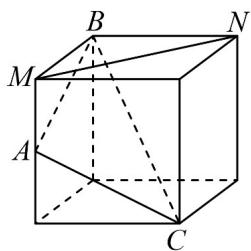
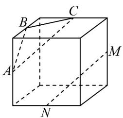
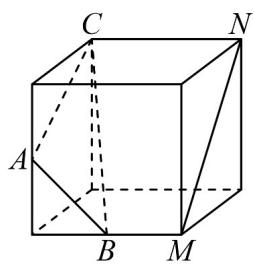
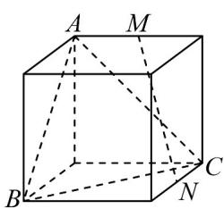
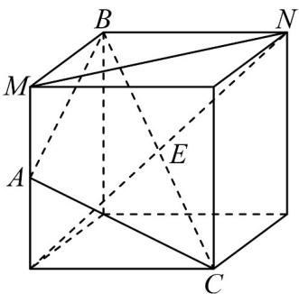
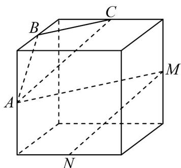
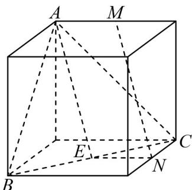

> [!faq]- 《专题05 线面位置关系的四大常考题型（高效培优专项训练）》官方解析
>
> > [!success]- **【答案】** A.  B.   C. D. 
>
> > [!note]- **【分析】**
> > 根据线面平行的判定定理逐项判断即可.
>
> > [!note]- **【解析】**
> > 选项 A，如题所示连接 ND 交 BC 与 E，则 E 为 BC 中点，
> >
> > 
> >
> > 又因为 A 是 MD 中点，所以 $AE \parallel MN$ ，
> >
> > 因为 $MN \not\subset$ 平面 ABC ， $AE \subset$ 平面 ABC ，所以 $MN \parallel$ 平面 ABC ，A 满足题意；
> >
> > 选项 B，将直线 MN 平移使得点 N 与点 C 重合，则显然可知 MN 与平面 ABC 不平行，B 不满足题意；
> > 选项 C，连接 AM，由条件和正方体的性质可知 $BC \parallel AM$ ， $AC \parallel MN$ ，
> >
> > 
> >
> > 所以 A, B, C, M, N 五点共面，即 MN 在平面 ABC 内，所以 MN 与平面 ABC 不平行，C 不满足题意；
> >
> > 选项 D，取 BC 的中点为 E，连接 AE, NE
> >
> > 
> >
> > 因为 $N$ 是棱上中点，所以 $EN \parallel AM$ ， $EN = AM$ ，所以四边形 $AMNE$ 是平行四边形，
> >
> > 所以 $MN \parallel AE$ ，因为 $MN \notin$ 平面 ABC， $AE \subset$ 平面 ABC，所以 $MN \parallel$ 平面 ABC，D 满足题意；
> >
> > 故选 **AD**
