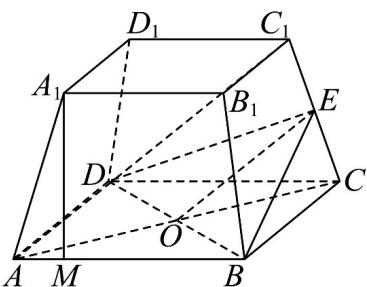

> [!faq]- 《专题05 线面位置关系的四大常考题型（高效培优专项训练）》官方解析
>
> > [!success]- **【答案】** (1)证明见解析 (2) $160+48\sqrt{14}$
>
> > [!note]- **【分析】**
> > （1）连接 $AC$ ，交 $BD$ 于点 $O$ ，连接 $OE$ 。根据三角形中位线定理证明 $OE // AC_{1}$ ，再利用线面平行的判定定理即可证明；
> >
> > (2) 在梯形 $ABB_{1}A_{1}$ 中，过 $A_{1}$ 作 $A_{1}M \perp AB$ 交 $AB$ 于点 $M$ ，根据平面几何知识可求出 $A_{1}M$ ，进而可求 $S_{\text{梯形}ABB_{1}A_{1}}$ ，即可求解正四棱台 $ABCD - A_{1}B_{1}C_{1}D_{1}$ 的表面积.
>
> > [!note]- **【解析】**
> > （1）（1）连接 AC，交 BD 于点 O，连接 OE，如图所示.
> >
> > 在正四棱台 $ABCD - A_{1}B_{1}C_{1}D_{1}$ 中，底面 ABCD 为正方形，所以 O 为 AC 中点.
> >
> > 
> >
> > 又∵ E 为 $CC_{1}$ 的中点，∴ $OE // AC_{1}$
> >
> > 又 $OE \subset$ 平面 $BDE$ , $AC_{1} \notin$ 平面 $BDE$ , $\therefore AC_{1} //$ 平面 $BDE$ .
> >
> > (2) 由题可知：在梯形 $ABB_{1}A_{1}$ 中， $A_{1}B_{1}=4\sqrt{2}$ ， $AB=8\sqrt{2}$ ， $AA_{1}=6$
> >
> > 过 $A_{1}$ 作 $A_{1}M \perp AB$ 交 $AB$ 于点 $M$ ， $\therefore AM = 2\sqrt{2}$ ， $\therefore A_{1}M = \sqrt{A_{1}A^{2} - AM^{2}} = 2\sqrt{7}$ ，
> >
> > 所以 $S_{\text{梯形} ABB_1A_1} = \frac{1}{2}\left(A_1B_1 + AB\right) \cdot A_1M = \frac{1}{2} \times \left(4\sqrt{2} + 8\sqrt{2}\right) \times 2\sqrt{7} = 12\sqrt{14}$
> >
> > ∴正四棱台 $ABCD - A_{1}B_{1}C_{1}D_{1}$ 的表面积为
> >
> > $S = S_{\text{正方形}A_1B_1C_1D_1} + S_{\text{正方形}ABCD} + 4S_{\text{梯形}ABB_1A_1} = (4\sqrt{2})^2 + (8\sqrt{2})^2 + 4 \times 12\sqrt{14} = 160 + 48\sqrt{14}$ .
