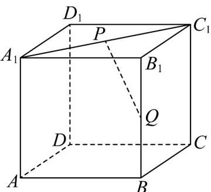
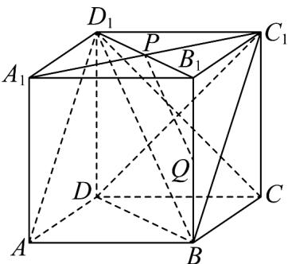
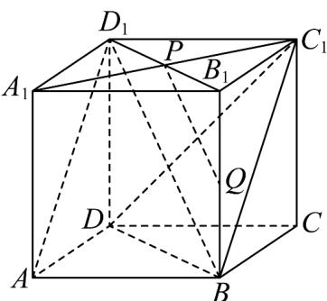

> [!faq]- 《专题05 线面位置关系的四大常考题型（高效培优专项训练）》官方解析
>
> > [!success]- **【答案】**  A. $AD_{1}$ B. $BD_{1}$ C. $CD_{1}$ D. $DD_{1}$
>
> > [!note]- **【分析】**
> > 根据正方体的性质，利用线面平行的判断和性质、中位线的性质、异面直线的定义、平面内两直线的位置关系逐一判断即可.
>
> > [!note]- **【解析】**
> > 连接 $B_{1}D_{1}$ ，正方体 $ABCD-A_{1}B_{1}C_{1}D_{1}$ 中，P是线段 $A_{1}C_{1}$ 的中点，所以P是线段 $B_{1}D_{1}$ 的中点.
> >
> > 
> >
> > 由 $PQ // BD_{1}$ ， $PQ \notin$ 平面 $ABC_{1}D_{1}, BD_{1} \subset$ 平面 $ABC_{1}D_{1}$ ，得 $PQ \parallel$ 平面 $ABC_{1}D_{1}$ ，所以 $PQ$ 与 $AD_{1}$ 不相交，故 A 不正确；
> >
> > 由 P、Q 分别是线段 $B_{1}D_{1}$ 、 $BB_{1}$ 的中点，得 $PQ \parallel BD_{1}$ ，故 B 不正确；
> >
> > 由 $PQ \subset$ 平面 $BDD_{1}B_{1}$ ， $D_{1} \notin PQ$ ， $C \notin$ 平面 $BDD_{1}B_{1}$ ，得 $CD_{1}$ 与直线 $PQ$ 异面，故 $C$ 不正确；
> >
> > 对于 D，因为 $DD_{1} \parallel BB_{1}$ ， $BB_{1} \cap PQ = Q$ ，所以 $DD_{1}$ 与直线 PQ 不平行，又 $DD_{1}$ ， $PQ \subset$ 平面 $BDD_{1}B_{1}$ ，所以 $DD_{1}$ 与直线 PQ 相交，故 D 正确.
> >
> > 
> >
> > 故选 **D**.
