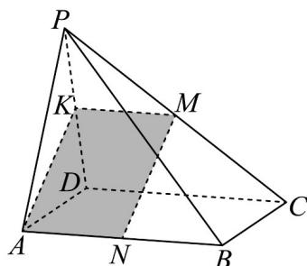
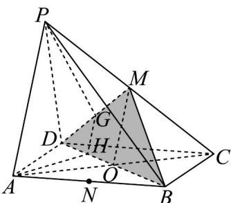

> [!faq]- 《专题05 线面位置关系的四大常考题型（高效培优专项训练）》官方解析
>
> > [!success]- **【答案】** (1)证明见解析 (2)证明见解析
>
> > [!note]- **【分析】**
> > （1）方法一：构造平行四边形，证得 $AK // MN$ ，再根据线面平行的判定定理证明即可；方法二：构造三角形的中位线，证得平面 $MON //$ 平面 $PAD$ ，根据 $MN \subset$ 平面 $MON$ ，即可证明；
> >
> > (2) 先通过三角形中位线证得 $PA \parallel$ 平面 $BDM$ ，再根据线面平行的性质定理证明即可.
>
> > [!note]- **【解析】**
> > （1）
> >
> > 
> >
> > 法一：取 PD 中点 K，连接 MK，AK，MN，
> >
> > 易知 $MK$ 为 $\triangle PCD$ 中位线，故 $MK // CD$ ，且 $MK = \frac{1}{2} CD$
> >
> > 因为四边形 $ABCD$ 是平行四边形，所以 $AB // CD$ ， $AB = CD$
> >
> > 故 $MK // AN$ ，又因为 $N$ 是 $AB$ 的中点，所以 $AN = \frac{1}{2} AB = \frac{1}{2} CD = MK$
> >
> > 所以四边形 ANMK 为平行四边形，所以 AK // MN
> >
> > 又因为 $MN \notin$ 平面 PAD ， $AK \subset$ 平面 PAD ，所以 $MN //$ 平面 PAD .
> >
> > 法二：连接 AC，交 BD 于 O，连接 MO，如下图：
> >
> > 
> >
> > 因为四边形 ABCD 是平行四边形，所以 O 为 AC 中点，
> >
> > 又因为 M 为 PC 中点，所以 MO 为 $\triangle ACP$ 的中位线，
> >
> > 所以 MO // PA，
> >
> > 又因为 $MO \notin$ 平面 PAD ， $PA \subset$ 平面 PAD ，所以 $MO \parallel$ 平面 PAD ，
> >
> > 因为四边形 $ABCD$ 是平行四边形，所以 $O$ 为 $BD$ 中点，
> >
> > 又因为 N 是 AB 的中点，所以 NO 为 $\triangle ABD$ 的中位线，
> >
> > 所以 $NO // AD$ ，又因为 $NO \notin$ 平面 $PAD$ ， $AD \subset$ 平面 $PAD$
> >
> > 所以 $NO \parallel$ 平面 $PAD$ ，又因为 $NO \cap MO = O$
> >
> > $NO \subset$ 平面 $MON$ ， $MO \subset$ 平面 $MON$ ，所以平面 $MON //$ 平面 $PAD$ ，
> >
> > 因为 $MN \subset$ 平面 MON ，所以 $MN \parallel$ 平面 PAD .
> >
> > (2) 连接 AC，交 BD 于 O，连接 MO，如下图：
> >
> > 
> >
> > 因为四边形 $ABCD$ 是平行四边形，所以 $O$ 是 $AC$ 的中点，
> >
> > 又因为 M 是 PC 的中点，所以 MO 为 $\triangle ACP$ 的中位线，
> >
> > 所以 MO//PA，
> >
> > 又因为 $MO \subset$ 平面 BDM ， $PA \not\subset$ 平面 BDM ，
> >
> > 所以 PA// 平面 BDM ，
> >
> > 又因为 $PA \subset$ 平面 $PAHG$ ，平面 $PAHG \cap$ 平面 $BDM = GH$
> >
> > 所以 $AP \parallel HG$ .
