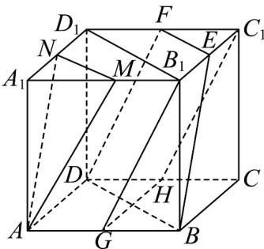

> [!faq]- 《专题05 线面位置关系的四大常考题型（高效培优专项训练）》官方解析
>
> > [!success]- **【答案】** (1)证明见解析； (2) $\frac{7}{3}$
>
> > [!note]- **【分析】**
> > （1）连接 $B_{1}D_{1}$ ，则 $MN//B_{1}D_{1}//EF$ ，分别取 $AB$ 、 $DC$ 的中点 $G$ 、 $H$ ，连接 $GH$ ， $B_{1}G$ ， $C_{1}H$ ，推导出四边形 $AGB_{1}M$ ，四边形 $DHC_{1}F$ ，四边形 $GB_{1}C_{1}H$ 为平行四边形，从而 $AM//GB_{1}//C_{1}H//FD$ ，由此即可证明；
> >
> > (2) 求出 $S_{\triangle C_{1}EF}$ ， $S_{\triangle BCD}$ ，h，根据棱台的体积公式，即可求出三棱台 CBD- $C_{1}EF$ 的体积.
>
> > [!note]- **【解析】**
> > （1）连接 $B_{1}D_{1}$ ，则 $MN / / B_{1}D_{1} / / EF$
> >
> > 因为 $EF \subset$ 面DBEF
> >
> > 所以 $MN//$ 面DBEF，
> >
> > 分别取 AB 、 DC 的中点 G 、 H ，连接 GH ， $B_{1}G$ ， $C_{1}H$
> >
> > 在四边形 $AGB_{1}M$ 中， $AG//MB_{1}$ 且 $AG = MB_{1}$
> >
> > 所以四边形 $AGB_{1}M$ 为平行四边形，
> >
> > 同理可得四边形 $DHC_{1}F$ 也是平行四边形，
> >
> > $$
> > \text { 又 } G H / / B C / / B _ {1} C _ {1}, G H = B C = B _ {1} C _ {1}
> > $$
> >
> > 所以四边形 $GB_{1}C_{1}H$ 为平行四边形，
> >
> > 所以 $AM // GB_{1} // C_{1} H // FD$
> >
> > 因为 $FD \subset$ 面 DBEF ，
> >
> > 所以 $AM / /$ 面DBEF，
> >
> > 因为 $AM \cap MN = M$ ，
> >
> > 所以平面 $AMN//$ 平面 $DBEF$ .
> >
> > 
> >
> > (2) 由题可知， $S_{\triangle C_{1}EF}=\frac{1}{2}\times1\times1=\frac{1}{2}$ ， $S_{\triangle BCD}=\frac{1}{2}\times2\times2=2$ ，h=2，
> >
> > 根据棱台的体积公式，可得三棱台 $CBD-C_{1}EF$ 的体积为：
> >
> > $$
> > V = \frac {1}{3} \times \left(\frac {1}{2} + 2 + \sqrt {\frac {1}{2} \times 2}\right) \times 2 = \frac {1}{3} \times \frac {7}{2} \times 2 = \frac {7}{3}.
> > $$
