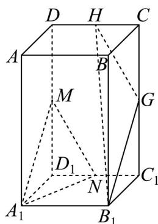
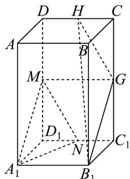

> [!faq]- 《专题05 线面位置关系的四大常考题型（高效培优专项训练）》官方解析
>
> > [!success]- **【答案】** $$ D D _ {1}, C _ {1} D _ {1}, C C _ {1}, D C $$  A. 此长方体的表面积为112 B. $A_{1}M$ 与 $B_{1}H$ 是相交直线 C. $A_{1}N$ 与 $B_{1}G$ 是异面直线 D. 直线 $A_{1}N$ 与平面 $B_{1}GH$ 相交
>
> > [!note]- **【分析】**
> > 对于 A 求出长方体的表面积即可判断，对于 B 即证平面 $A_{1}MN \parallel$ 平面 $B_{1}GH$ 即可判断，对于 C，根据异面直线定义即可判断，对于 D 即证直线 $A_{1}N \parallel$ 平面 $B_{1}GH$ 即可判断.
>
> > [!note]- **【解析】**
> > 此长方体的表面积为 $4 \times 7 \times 4 + 4 \times 4 \times 2 = 144$ ，故 A 错误；
> >
> > 连接 MG，因为 $A_{1}B_{1} \parallel MG, A_{1}B_{1} = MG$
> >
> > 所以四边形 $A_{1}B_{1}GM$ 为平行四边形，所以 $A_{1}M \parallel B_{1}G$ ，
> >
> > 因为 $A_{1}M \subset$ 平面 $A_{1}MN, B_{1}G \not\subset$ 平面 $A_{1}MN$ ，所以 $B_{1}G \parallel$ 平面 $A_{1}MN$ ，
> >
> > 因为 $GH \parallel MN, MN \subset$ 平面 $A_{1}MN, GH \notin$ 平面 $A_{1}MN$
> >
> > 所以 $GH \parallel$ 平面 $A_{1}MN$ ，又 $B_{1}G \cap GH = G, GH, B_{1}G \subset$ 平面 $B_{1}GH$ ，
> >
> > 所以平面 $A_{1}MN \parallel$ 平面 $B_{1}GH$ ，又 $A_{1}M \subset$ 平面 $A_{1}MN, B_{1}H \subset$ 平面 $B_{1}GH$ ，
> >
> > 所以 $A_{1}M$ 与 $B_{1}H$ 无公共点，故B错误；
> >
> > 又因为 $A_{1}N \subset$ 平面 $A_{1}MN$ ，所以直线 $A_{1}N \parallel$ 平面 $B_{1}GH$ ，故 D 错误.
> >
> > 因为 $A_{1}N \subset$ 平面 $A_{1}B_{1}C_{1}D_{1}, B_{1}G \cap$ 平面 $A_{1}B_{1}C_{1}D_{1} = B_{1}, B_{1} \notin A_{1}N$
> >
> > 所以 $A_{1}N$ 与 $B_{1}G$ 异面，故 C 正确.
> >
> > 故选：C.
> >
> > 
