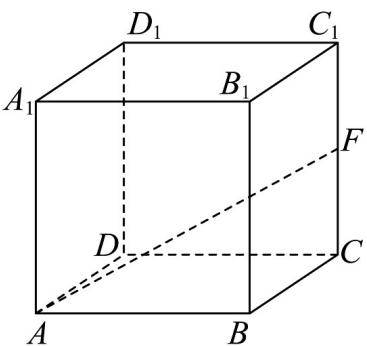
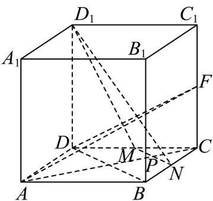

> [!faq]- 《专题05 线面位置关系的四大常考题型（高效培优专项训练）》官方解析
>
> > [!success]- **【答案】** 
>
> > [!note]- **【分析】**
> > 作出辅助线，得到 $AF \perp$ 平面 $MND_{1}$ ，当点 $P$ 在线段 $MN$ 上时， $D_{1}P \subset$ 平面 $MND_{1}$ ，故 $D_{1}P \perp AF$ 求出各边长，利用余弦定理得到 $\angle D_{1}MN$ 为钝角，则 $D_{1}P$ 的最小值为 $D_{1}M$ 的长度 $\sqrt{5}$ 。
>
> > [!note]- **【解析】**
> > 取 CD, BC 的中点 M, N ，连接 $D_{1}M, D_{1}N, MN$ ， BD ， AC, DF ，
> >
> > 故 $BD // MN$ ，
> >
> > 因为 $AC \perp BD$ ，所以 $AC \perp MN$ ，
> >
> > 因为 $CF_{\perp}$ 平面 ABCD， $MN \subset$ 平面 ABCD，所以 $CF_{\perp}MN$ ，
> >
> > 因为 $AC \cap CF = C$ ， $AC, CF \subset$ 平面 ACF，所以 $MN_{\perp}$ 平面 ACF，
> >
> > 因为 $AF \subset$ 平面 $ACF$ ，所以 $MN_{\perp}AF$
> >
> > 因为 $DM = CF = 1$ ， $DD_{1} = CD = 2$ ， $\angle D_{1}DC = \angle C_{1}CD = 90^{\circ}$
> >
> > 所以 $\triangle D_{1}DM\cong \triangle DCF$ ，故 $\angle D_1MD = \angle DFC$
> >
> > 所以 $\angle D_{1}MD + \angle CDF = \angle DFC + \angle CDF = 90^{\circ}$ ，故 $D_{1}M \perp DF$ ，
> >
> > 因为 $AD \perp$ 平面 $D_{1}DCC_{1}$ ， $D_{1}M \subset$ 平面 $D_{1}DCC_{1}$ ，所以 $AD \perp D_{1}M$
> >
> > 因为 $DF \cap AD = D$ ， $DF, AD \subset$ 平面 ADF，所以 $D_{1}M \perp$ 平面 ADF，
> >
> > 因为 $AF \subset$ 平面 $ADF$ ，所以 $D_{1}M_{\perp AF}$
> >
> > 因为 $MN \cap D_{1}M = M$ ， $MN, D_{1}M \subset$ 平面 $MND_{1}$ ，所以 $AF \perp$ 平面 $MND_{1}$
> >
> > 当点 P 在线段 MN 上时， $D_{1}P \subset$ 平面 $MND_{1}$ ，故 $D_{1}P \perp AF$ ，
> >
> > 其中 $D_{1}M = \sqrt{4 + 1} = \sqrt{5}$ ， $MN = \sqrt{2}$ ， $D_{1}N = \sqrt{D_{1}C_{1}^{2} + C_{1}C^{2} + CN^{2}} = \sqrt{4 + 4 + 1} = 3$
> >
> > $\cos \angle D_{1}MN = \frac{5 + 2 - 9}{2\sqrt{5}\times\sqrt{2}} < 0$ ，故 $\angle D_1MN$ 为钝角，
> >
> > 则 $D_{1}P$ 的最小值为 $D_{1}M$ 的长度 $\sqrt{5}$ .
> >
> > 
> >
> > 故答案为： $\sqrt{5}$
