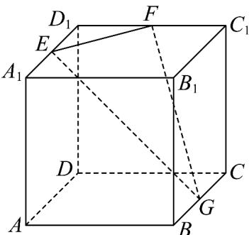
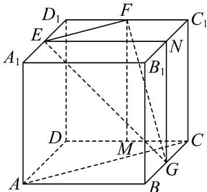

> [!faq]- 《专题05 线面位置关系的四大常考题型（高效培优专项训练）》官方解析
>
> > [!success]- **【答案】**  A. $AC / /$ 平面EFG B. $G$ 为 $BC$ 中点时 $EF \perp FG$ C．G 为 BC 中点时异面直线 AB 与 EG 所成的角为 $60^{\circ}$ D．棱锥 $G - EFD_{1}$ 的体积为定值
>
> > [!note]- **【分析】**
> > 作出图形，由线面平行的判定定理判断 A，线面垂直的判定定理及性质判断 B，由异面直线所成角的解法判断 C，由点 G 到平面 $EFD_{1}$ 的距离为定值，由三棱锥体积公式判断 D．
>
> > [!note]- **【解析】**
> > 如图， $EF // A_{1}C_{1}, AC // A_{1}C_{1}$ ，则 $EF // AC, AC \not\subset$ 平面 EFG， $EF \subset$ 平面 EFG，
> >
> > 则有 AC // 平面 EFG，故 A 正确；
> >
> > 设 CD 中点为 M，若 G 为 BC 中点，则有 $AC \perp MG, AC \perp MF, MG \cap MF = M$ ,
> >
> > $MG, MF \subset$ 平面 $MFG$
> >
> > 则 $AC \perp$ 平面 MFG，又 $FG \subset$ 平面 MFG，
> >
> > 则 $AC \perp FG$ ，因为 $EF \parallel AC$ ，所以 $EF \perp FG$ ，故 B 正确；
> >
> > 设正方体棱长为 2，取 $B_{1}C_{1}$ 中点为 N，连接 EN，因为 EN // AB
> >
> > 所以异面直线 AB 与 EG 所成的角即为 $\angle NEG$ ，
> >
> > 因为 G 为 BC 中点，在正方体 $ABCD - A_{1}B_{1}C_{1}D_{1}$ 中，易得 EN = NG， $EN \perp NG$ ，
> >
> > 所以角 $\angle NEG = 45^{\circ}$ ，故C错误；
> >
> > 易知 $BC / /$ 平面 $EFD_{1}$ ，则点 $G$ 到平面 $EFD_{1}$ 的距离为定值，
> >
> > 所以三棱锥 $G-EFD_{1}$ 的体积为定值，故 D 正确.
> >
> > 
> >
> > 故选 **ABD**.
