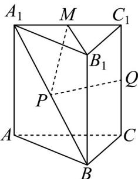
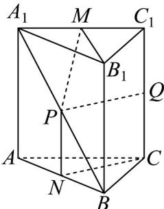
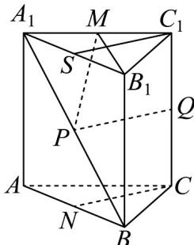

> [!faq]- 《专题05 线面位置关系的四大常考题型（高效培优专项训练）》官方解析
>
> > [!success]- **【答案】**  A. $PM$ 与 $QC_{1}$ 是异面直线 B. $PQ / /$ 平面 $ABC$ C. $PQ \perp A_{1}B$ D. $PQ \perp B_{1}M$
>
> > [!note]- **【分析】**
> > 利用反证法可判断 AD；取 AB 的中点，利用线线平行可得 B；利用 $CN \perp AA_{1}, CN \perp AB$ ，判断即可.
>
> > [!note]- **【解析】**
> > 对 A，点 $M, C_{1}, Q \in$ 平面 $ACC_{1}A_{1}$ ，若 PM 与 $QC_{1}$ 不是异面直线，则 PM 与 $QC_{1}$ 共面，所以 $P \in$ 平面 $ACC_{1}A_{1}$ ，
> >
> > 又 $P \in A_{1}B, A_{1}B \cap$ 平面 $ACC_{1}A_{1} = A_{1}$ ，故 $P \notin$ 平面 $ACC_{1}A_{1}$ ，所以 PM 与 $QC_{1}$ 是异面直线，正确；
> >
> > 对B，取 $AB$ 的中点 $N$ ，连接 $CN$ ，如图：
> >
> > 
> >
> > 由 $P$ 为 $A_{1}B$ 的中点，所以 $PN // AA_{1}$ 且 $PN = \frac{1}{2} AA_{1}$ ，由 $Q$ 为 $CC_{1}$ 的中点， $CC_{1}$ 平行且等于 $AA_{1}$ ，所以 $CQ // AA_{1}$ 且 $CQ = \frac{1}{2} AA_{1}$ ，所以 $CQ$ 平行且等于 $PN$ ，所以四边形 $PNCQ$ 为平行四边形，所以 $PQ // CN$ ， $PQ \notin$ 平面 $ABC$ ， $CN \subset$ 平面 $ABC$ ，所以 $PQ //$ 平面 $ABC$ ，正确；对 $C$ ，因为 $CA = CB$ ，所以 $CN \perp AB$ ，又 $AA_{1} \perp$ 平面 $ABC$ ， $CN \subset$ 平面 $ABC$ ，所以 $CN \perp AA_{1}$ ， $AB \cap AA_{1} = A, AB, AA_{1} \subset$ 平面 $ABA_{1}$ ，所以 $CN \perp$ 平面 $ABA_{1}$ ，又 $A_{1}B \subset$ 平面 $ABA_{1}$ ，所以 $CN \perp A_{1}B$ ，又 $PQ // CN$ ，所以 $PQ \perp A_{1}B$ ，正确；对 $D$ ，取 $A_{1}B_{1}$ 的中点 $S$ ，连接 $C_{1}S$ ，如图：
> >
> > 
> >
> > 在直三棱柱 $ABC-A_{1}B_{1}C_{1}$ 中，可知 $C_{1}S//CN//PQ$ ，又 $CN\perp AB$ ，所以 $C_{1}S\perp A_{1}B_{1}$ ，则 $PQ\perp A_{1}B_{1}$ ，若 $PQ\perp B_{1}M$ ，则 $A_{1},B_{1},M$ 共线，又 M 是 $A_{1}C_{1}$ 的中点，与已知矛盾，错误。
> >
> > 故选 **D**
