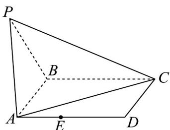
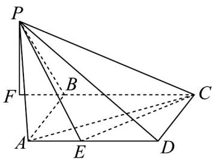

> [!faq]- 《专题05 线面位置关系的四大常考题型（高效培优专项训练）》官方解析
>
> > [!success]- **【答案】**  A. $\frac{\sqrt{3}}{3}$ B. $\frac{\sqrt{3}}{2}$ C. $\sqrt{3}$ D. 1
>
> > [!note]- **【分析】**
> > 过点 $P$ 作 $PF \perp BC$ ，交直线 $BC$ 于点 $F$ ，证明 $PF \perp$ 平面 $ABCD$ ，求出 $PF$ 即可求解.
>
> > [!note]- **【解析】**
> > 如图，过点 $P$ 作 $PF \perp BC$ ，交直线 $BC$ 于点 $F$ ，
> >
> > 
> >
> > 又因为平面 $PBC \perp$ 平面 ABCD，平面 $PBC \cap$ 平面 ABCD = BC， $PF \subset$ 平面 PBC，
> >
> > 所以 $PF \perp$ 平面 ABCD，
> >
> > 因为 $\triangle PBC$ 的面积为3， $BC = 2$
> >
> > 所以 $\frac{1}{2} BC\cdot PF = 3$ ，即 $\frac{1}{2}\times 2\cdot PF = 3$
> >
> > 解得 $PF = 3$ ，所以三棱锥 $P - ACE$ 的体积 $V_{P - ACE} = \frac{1}{3} S_{\triangle ACE}\cdot PF = S_{\triangle ACE}\leq S_{\triangle ACD} = \frac{1}{2}\times 2\times 1 = 1$
> >
> > 当且仅当点 E 在点 D 时取等号，
> >
> > 三棱锥 P-ACE 体积的最大值为 1.
> >
> > 故选 **D**.
