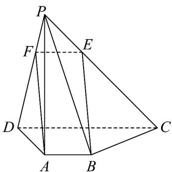

> [!faq]- 《专题05 线面位置关系的四大常考题型（高效培优专项训练）》官方解析
>
> > [!success]- **【答案】** (1)证明见解析 (2)证明见解析 (3) $\frac{3}{13}\sqrt{13}$
>
> > [!note]- **【分析】**
> > （1）在 $PD$ 上取点 $F$ ，使 $PF = \frac{1}{3} PD$ ，利用条件证明四边形ABEF为平行四边形，即得 $BE // AF$ ，再由线线平行可证线面平行；
> >
> > （2）由条件先证明 $AB \perp$ 平面 $PAD$ ，再由 $AB // CD$ 得到 $CD \perp$ 平面 $PAD$ ，接着利用面面垂直的判定定理可证平面 $PAD \perp$ 平面 $PCD$ ；
> >
> > (3) 由 (2) 的结论: $CD \perp$ 平面 $PAD$ , 可得 $\angle CPD$ 即直线 $PC$ 与平面 $PAD$ 所成角, 在 Rt $\triangle PDC$ 中利用三角函数的定义即得答案.
>
> > [!note]- **【解析】**
> > （1）
> >
> > 
> >
> > 如图，在 $PD$ 上取点 $F$ ，使 $PF = \frac{1}{3} PD$ ，连接 $EF, AF$ ，因 $PE = \frac{1}{3} PC$ ，则 $EF // CD$ ，
> >
> > 则得 $\triangle PEF\sim \triangle PCD$ ，故 $EF = \frac{1}{3} CD = 1$ ，因 $AB / / CD,AB = \frac{1}{3} CD = 1$ 则 $AB / / EF,AB = EF$
> >
> > 即四边形 $ABEF$ 为平行四边形，则 $BE // AF$ ，又 $BE \notin$ 平面 $PAD$ ， $AF \subset$ 平面 $PAD$ ，故 $BE //$ 平面 $PAD$ .
> >
> > (2) 因 $PA \perp$ 平面 $ABCD$ , $AB \subset$ 平面 $ABCD$ , 则 $PA \perp AB$
> >
> > 因 $PD \perp AB$ ， $PA \cap PD = P, PA, PD \subset$ 平面 $PAD$ ，故 $AB \perp$ 平面 $PAD$
> >
> > 因 $AB \parallel CD$ ，故 $CD \perp$ 平面 $PAD$ ，又 $CD \subset$ 平面 $PCD$ ，故平面 $PAD \perp$ 平面 $PCD$ .
> >
> > (3) 由 (2) 已得 $CD \perp$ 平面 $PAD$ , 故 $\angle CPD$ 即直线 $PC$ 与平面 $PAD$ 所成角,
> >
> > 因 $CD = 3, PD = \sqrt{2^2 + 3^2} = \sqrt{13}$ ，故在 Rt△PDC 中， $\tan \angle CPD = \frac{CD}{PD} = \frac{3}{13}\sqrt{13}$
> >
> > 即直线 $PC$ 与平面 $PAD$ 所成角的正切值为 $\frac{3}{13}\sqrt{13}$ .
