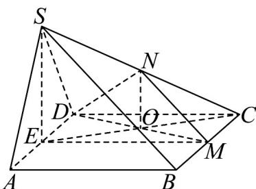

> [!faq]- 《专题05 线面位置关系的四大常考题型（高效培优专项训练）》官方解析
>
> > [!success]- **【答案】** (1)平面 SCD，平面 SAB (2)证明见解析 (3)存在， $\frac{\sqrt{3}}{6}$
>
> > [!note]- **【分析】**
> > （1）由已知可得 $AB // ME$ ， $DC // ME$ ，然后由线面平行的判定定理可得结论；
> >
> > (2) 由已知面面垂直可得 $AB \perp$ 平面 $SAD$ ，再由面面垂直的判定定理可证得结论；
> >
> > (3) 当 $N$ 为 $SC$ 中点时，满足条件，连接 $EC, ON, SE, DM$ ，设 $DM \cap EC = O$ ，可得 $NO // SE$ ， $SE \perp AD$ ，再结合面面垂直可得 $NO \perp$ 平面 $ABCD$ ，然后由面面垂直的判定得平面 $DMN \perp$ 平面 $ABCD$ ，利用等体积法可求得三棱锥 $C - DMN$ 体积.
>
> > [!note]- **【解析】**
> > （1）因为四边形 ABCD 为正方形，E, M 分别为 AD、BC 的中点.
> >
> > 所以 $AE = DE = MC = BM$ ， $AE / / BM$ ， $DE / / CM$
> >
> > 所以四边形 $ABME$ 和四边形 $DCME$ 均为平行四边形，
> >
> > 所以 $AB \parallel ME$ ， $DC \parallel ME$
> >
> > 因为 $ME \not\subset$ 平面 SAB ， $AB \subset$ 平面 SAB ， $ME \not\subset$ 平面 SCD ， $DC \subset$ 平面 SCD ，
> >
> > 所以 EM // 平面 SAB ， EM // 平面 SCD ；
> >
> > (2) 因为四边形 ABCD 为正方形，所以 $AB \perp AD$ ，
> >
> > 因为平面 $SAD \perp$ 平面 ABCD ，且平面 $SAD \cap$ 平面 ABCD = AD ， $AB \subset$ 平面 ABCD ，
> >
> > 所以 $AB \perp$ 平面 SAD.
> >
> > 因为 $AB \subset$ 平面 SAB ，所以平面 $SAD \perp$ 平面 SAB .
> >
> > (3) 存在，当 $N$ 为 $SC$ 中点时，平面 $DMN \perp$ 平面 $ABCD$ .
> >
> > 证明：连接 $EC, ON, SE, DM$ ，设 $DM \cap EC = O$
> >
> > 
> >
> > 因为四边形 ABCD 为正方形，E，M 分别为 AD、BC 的中点，
> >
> > 所以 $ED / / CM$ ， $ED = CM$
> >
> > 所以四边形 EMCD 为平行四边形，所以 EO = CO .
> >
> > 因为 N 为 SC 中点，所以 NO // SE .
> >
> > 因为 $SA = SD = AD = 2$ ， $E$ 为 $AD$ 的中点，
> >
> > 所以 $SE \perp AD$ ， $SE = \sqrt{3}$ ， $NO = \frac{\sqrt{3}}{2}$
> >
> > 因为平面 $SAD \perp$ 平面 $ABCD$ ，平面 $SAD \cap$ 平面 $ABCD = AD$ ， $SE \subset$ 平面 $SAD$
> >
> > 所以 $SE \perp$ 平面 ABCD ，
> >
> > 所以 $NO \perp$ 平面ABCD.
> >
> > 又因为 $NO \subset$ 平面 DMN ，所以平面 DMN ⊥ 平面 ABCD .
> >
> > 所以存在点 $N$ ，使得平面 $DMN \perp$ 平面 $ABCD$ .
> >
> > 则 $V_{C-DMN} = V_{N-CDM} = \frac{1}{3} \times \frac{1}{2} \times 2 \times 1 \times \frac{\sqrt{3}}{2} = \frac{\sqrt{3}}{6}$ .
