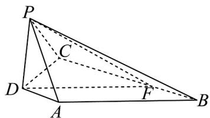

> [!faq]- 《专题05 线面位置关系的四大常考题型（高效培优专项训练）》官方解析
>
> > [!success]- **【答案】** (1)证明见解析 (2) $\frac{\sqrt{2}}{3}$
>
> > [!note]- **【分析】**
> > （1）利用线面垂直的判定定理证 $PD \perp$ 平面 $PBC$ ，最后利用面面垂直的判断定理即可得证；
> >
> > (2) 过点 $D$ 作 $DF \parallel AB$ 交 $BC$ 于点 $F$ ，连接 $PF$ ，则 $AB$ 与平面 $PBC$ 所成角即为 $DF$ 与平面 $PBC$ 所成角，由 $PD \perp$ 平面 $PBC$ ，即 $\angle DFP$ 为直线 $DF$ 与平面 $PBC$ 所成角，在 Rt $\triangle DCF$ 中计算即可.
>
> > [!note]- **【解析】**
> > （1）∵ $AD \perp$ 平面 $PCD, PD \subset$ 平面 $PCD$ ，∴ $AD \perp PD$
> >
> > ∵ BC // AD, ∴ PD ⊥ BC，又 PD ⊥ PB, PB ∩ BC = B，PB, BC ⊂ 平面 PBC
> >
> > ∴ $PD \perp$ 平面 PBC ，又∵ $PD \subset$ 平面 PAD
> >
> > ∴平面 PAD⊥平面 PDC ;
> >
> > (2) 过点 $D$ 作 $DF \parallel AB$ 交 $BC$ 于点 $F$ , 连接 $PF$
> >
> > 则 $AB$ 与平面 $PBC$ 所成角即为 $DF$ 与平面 $PBC$ 所成角，
> >
> > ∵ $PD \perp$ 平面 PBC ，∴ PF 为 DF 在平面 PBC 上的射影，
> >
> > $\therefore \angle DFP$ 为直线 $DF$ 与平面 $PBC$ 所成角，
> >
> > ∵ AD // BC, DF // AB，∴ 四边形 DABF 为平行四边形，
> >
> > $\therefore BF = AD = 1, CF = BC - BF = 3$
> >
> > ∵ $AD \perp DC, \therefore BC \perp DC$
> >
> > 
> >
> > 在 $\mathrm{Rt}\triangle DCF$ 中， $DF = \sqrt{3^2 + 3^2} = 3\sqrt{2}$
> >
> > <!-- source-part:2 pages:51-56 -->
> >
> > 在 Rt△DPF 中， $\sin\angle DFP=\frac{2}{3\sqrt{2}}=\frac{\sqrt{2}}{3}$ ，
> >
> > 所以直线 $AB$ 与平面 $PBC$ 所成角的正弦值为 $\frac{\sqrt{2}}{3}$
