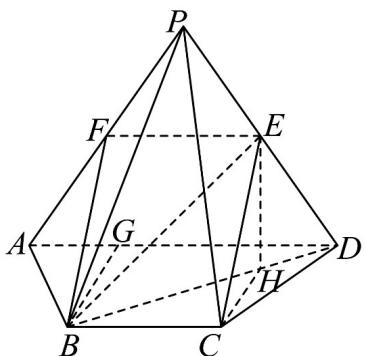

> [!faq]- 《专题05 线面位置关系的四大常考题型（高效培优专项训练）》官方解析
>
> > [!success]- **【答案】** (1)证明见解析； (2) (i) 证明见解析；(ii) $\frac{\sqrt{3}}{3}$ .
>
> > [!note]- **【分析】**
> > （1）取 PA 中点 F，利用线面平行的判定推理得证.
> >
> > (2) (i) 借助余弦定理、勾股定理的逆定理证得 $AB \perp BD$ ，再利用线面垂直的判定、面面垂直的判定推理得证. (ii) 作 $EH \perp BD$ 于点 $H$ ，利用几何法求出线面角的余弦.
>
> > [!note]- **【解析】**
> > （1）在四棱锥 P-ABCD 中，取 PA 中点 F，连接 EF、BF，
> >
> > 
> >
> > 由 $E$ 是 $PD$ 的中点，得 $EF // AD, EF = \frac{1}{2} AD = 1$ ，而 $AD // BC, BC = 1$ ，
> >
> > 则 $EF // BC, EF = BC$ ，四边形 $EFBC$ 是平行四边形， $CE // BF$ ， $CE \notin$ 平面 $PAB, BF \subset$ 平面 $PAB$ ，所以 $CE //$ 平面 $PAB$ .
> >
> > (2) (i) 在等腰梯形 $ABCD$ 中， $AD // BC$ ，过点 $B$ 作 $BG \perp AD$ 交 $AD$ 于点 $G$
> >
> > 由 AD = 2, BC = 1, $\angle BAD = 60^{\circ}$ ，得 AB = 1，
> >
> > 在 $\triangle ABD$ 中，由余弦定理得 $BD = \sqrt{2^2 + 1^2 - 2 \times 2 \times 1 \times \frac{1}{2}} = \sqrt{3}$ ，
> >
> > 则 $AD^2 = AB^2 + BD^2$ ， $AB \perp BD$ ，又 $AB \perp PB, PB \cap BD = B$ ， $PB, BD \subset$ 平面 $PBD$
> >
> > 因此 $AB \perp$ 平面 $PBD$ ，而 $AB \subset$ 平面 $ABCD$ ，
> >
> > 所以平面 $PBD \perp$ 平面 $ABCD$ .
> >
> > (ii) 过点 E 作 $EH \perp BD$ 于点 H，连接 CH，由平面 $PBD \perp$ 平面 ABCD，
> >
> > 平面 $PBD \cap$ 平面 ABCD = BD, $EH \subset$ 平面 PBD，则 $EH \perp$ 平面 ABCD，
> >
> > CH 是斜线 CE 在平面 ABCD 上的射影， $\angle ECH$ 是 CE 与底面 ABCD 所成的角，
> >
> > 在 Rt $\triangle PBA$ 中，PA = 2, AB = 1，得 $PB = \sqrt{3}$ ，CE = BF = $\frac{1}{2}$ PA = 1
> >
> > 在 $\triangle PBD$ 中， $PB = BD = \sqrt{3}, PD = 2, E$ 是 $PD$ 的中点，得 $BE = \sqrt{2}$ ， $BE \perp PD$ ，
> >
> > $EH = \frac{BE \cdot DE}{BD} = \frac{\sqrt{2} \cdot 1}{\sqrt{3}} = \frac{\sqrt{6}}{3}$ ，在 Rt $\triangle EHC$ 中， $CH = \sqrt{CE^{2} - EH^{2}} = \sqrt{1 - (\frac{\sqrt{6}}{3})^{2}} = \frac{\sqrt{3}}{3}$ ，
> >
> > $\cos \angle ECH = \frac{CH}{CE} = \frac{\sqrt{3}}{3}$ ，所以即直线 $AE$ 与底面ABCD成角的余弦值为 $\frac{\sqrt{3}}{3}$
