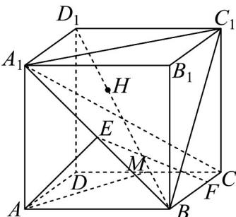
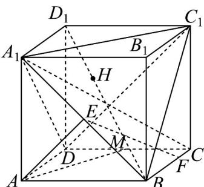

> [!faq]- 《专题05 线面位置关系的四大常考题型（高效培优专项训练）》官方解析
>
> > [!success]- **【答案】**  A. 平面 $AEF \perp$ 平面 $A_{1}BC$ B. 直线 $B_{1}D$ 与平面 $A_{1}BC_{1}$ 的交点 $H$ 是 $\triangle A_{1}C_{1}B$ 的重心 C. 直线 $AM$ 与直线 $BC_{1}$ 的夹角余弦值为 $\frac{\sqrt{10}}{5}$ D. 三棱锥 $B - ADE$ 的体积为 $\frac{4}{3}$
>
> > [!note]- **【分析】**
> > 对于选项 A，要证明面面垂直，则需通过证明线面垂直推导出面面垂直，即证明 $AE \perp$ 平面 $A_{1}BC$ ；对于选项 B，先证明四面体 $D - A_{1}BC_{1}$ 为正四面体，然后证明 $DB_{1} \perp$ 平面 $A_{1}BC_{1}$ ，从而可得到结果；对于选项 C，直线 AM 与直线 $BC_{1}$ 的夹角是直线 AM 与直线 $AD_{1}$ 的夹角 $\angle MAD_{1}$ ，然后通过边角关系求得其余弦值；对于选项 D，根据线段关系求得三棱锥的体积即可.
>
> > [!note]- **【解析】**
> > 对于选项A：
> >
> > 因为 $ABCD - A_{1}B_{1}C_{1}D_{1}$ 为正方体，所以 $BC \perp$ 平面 $ABB_{1}A_{1}$
> >
> > 因为 $AE \subset$ 平面 $ABB_{1}A_{1}$ ，所以 $AE \perp BC$ 。
> >
> > 因为 $A_{1}E = EB$ ，所以 $AE \perp A_{1}B$
> >
> > 又 $A_{1}B \cap BC = B, A_{1}B, BC \subset$ 平面 $A_{1}BC$ ，所以 $AE \perp$ 平面 $A_{1}BC$
> >
> > 因 $AE \subset$ 平面 AEF ，所以平面 $AEF \perp$ 平面 $A_{1}BC$ ，所以 A 正确；
> >
> > 对于选项 B :
> >
> > 连接 $DA_{1}, DC_{1}$ ，则 $DA_{1} = DC_{1} = DB = A_{1}B = A_{1}C_{1} = BC_{1}$
> >
> > 则四面体 $D - A_{1}BC_{1}$ 为正四面体，
> >
> > 因为 $A_{1}C_{1}\perp D_{1}B_{1},A_{1}C_{1}\perp B_{1}B$ ， $D_{1}B_{1}\cap B_{1}B = B_{1},D_{1}B_{1},B_{1}B\subset$ 平面 $BB_{1}D_{1}D$ 所以 $A_{1}C_{1}\perp$ 平面 $BB_{1}D_{1}D$ ，因为 $DB_{1}\subset$ 平面 $BB_{1}D_{1}D$ ，所以 $A_{1}C_{1}\perp DB_{1}$ 同理可得 $A_{1}B \perp DB_{1}$ ，因为 $A_{1}C_{1} \cap A_{1}B = A_{1}, A_{1}C_{1}, A_{1}B \subset$ 平面 $A_{1}BC_{1}$ .
> >
> > 所以 $DB_{1} \perp$ 平面 $A_{1}BC_{1}$ ，垂足为 H，又四面体 $D - A_{1}BC_{1}$ 为正四面体，
> >
> > 所以 H 为 $\triangle A_{1}BC_{1}$ 的中心，即 H 为 $\triangle A_{1}BC_{1}$ 的重心，所以 B 正确；
> >
> > 
> >
> > 对于选项 C :
> >
> > 因为 $BC_{1} // AD_{1}$ ，所以直线 AM 与直线 $BC_{1}$ 的夹角是直线 AM 与直线 $AD_{1}$ 的夹角 $\angle MAD_{1}$ .
> >
> > 因为 $AD_{1}=2\sqrt{2}, AM=D_{1}M=\sqrt{5}$ ，所以 $\cos\angle MAD_{1}=\frac{\frac{1}{2}AD_{1}}{AM}=\frac{\sqrt{2}}{\sqrt{5}}=\frac{\sqrt{10}}{5}$ ，C 正确；
> >
> > 因为 $S_{\triangle ABD} = \frac{1}{2}\times AB\times AD = 2$
> >
> > 所以三棱锥 $B - ADE$ 的体积为 $V = \frac{1}{3} \times 2 \times 1 = \frac{2}{3}$ ，所以D错误.
> >
> > 故选 **ABC**.
