<!-- source-part:1 pages:1-50 -->

## 专题8.1 基本立体图形

## 内容概览

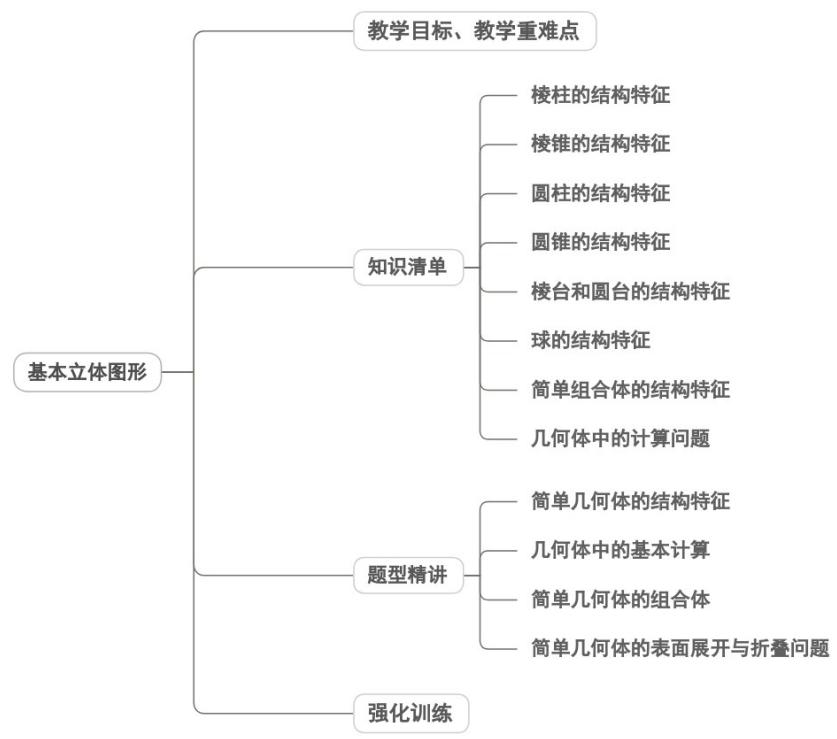

## 教学目标、教学重难点

<table><tr><td>教学目标</td><td>1.理解空间几何体的定义,能区分多面体(面、棱、顶点)与旋转体(旋转面、旋转轴)的核心构成要素;2.掌握棱柱、棱锥、棱台(多面体)及圆柱、圆锥、圆台、球(旋转体)的结构特征,明确各类几何体的本质属性(如棱柱的“两底平行、侧棱平行且相等”,圆台的“上下底平行、侧棱延长线共点”等);3.了解简单组合体的两种组成形式(拼接、截去/挖去),能识别现实生活中组合体的构成要素。</td></tr><tr><td>教学重难点</td><td>1.重点多面体(棱柱、棱锥、棱台)与旋转体(圆柱、圆锥、圆台、球)的结构特征抽象与概</td></tr></table>

括，这是后续学习空间点线面位置关系、表面积与体积的基础；

2.难点

理解几何体之间的内在联系与区别，如棱台与棱柱、棱锥的衍生关系，圆柱、圆锥、圆台通过旋转运动的转化关系，避免概念混淆；

## 知识清单

## 知识点 01 棱柱的结构特征

1、定义：一般地，有两个面互相平行，其余各面都是四边形，并且每相邻两个四边形的公共边都互相平行，

由这些面所围成的几何体叫做棱柱．在棱柱中，两个相互平行的面叫做棱柱的底面，简称底；其余各面叫做

棱柱的侧面；相邻侧面的公共边叫做棱柱的侧棱．侧面与底的公共顶点叫做棱柱的顶点．棱柱中不在同一平

面上的两个顶点的连线叫做棱柱的对角线．过不相邻的两条侧棱所形成的面叫做棱柱的对角面．

2、棱柱的分类：底面是三角形、四边形、五边形、……的棱柱分别叫做三棱柱、四棱柱、五棱柱……

3、棱柱的表示方法：

①用表示底面的各顶点的字母表示棱柱，如下图，四棱柱、五棱柱、六棱柱可分别表示为 $ABCD - A_{1}B_{1}C_{1}D_{1}$ 、 $ABCDE - A_{1}B_{1}C_{1}D_{1}E_{1}$ 、 $ABCDEF - A_{1}B_{1}C_{1}D_{1}E_{1}F_{1}$ ；

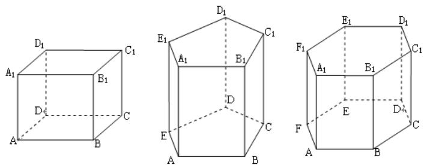

②用棱柱的对角线表示棱柱，如上图，四棱柱可以表示为棱柱 $A_{1}C$ 或棱柱 $D_{1}B$ 等；五棱柱可表示为棱柱 $AC_{1}$

棱柱 $AD_{1}$ 等；六棱柱可表示为棱柱 $AC_{1}$ 、棱柱 $AD_{1}$ 、棱柱 $AE_{1}$ 等.

4、棱柱的性质：棱柱的侧棱相互平行。

知识点诠释：

有两个面互相平行，其余各个面都是平行四边形，这些面围成的几何体不一定是棱柱．如下图所示的几何体

满足“有两个面互相平行，其余各个面都是平行四边形”这一条件，但它不是棱柱。

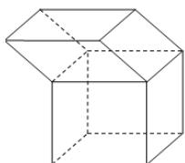

判定一个几何体是否是棱柱时，除了看它是否满足：“有两个面互相平行，其余各个面都是平行四边形”这两

个条件外，还要看其余平行四边形中“每两个相邻的四边形的公共边都互相平行”即“侧棱互相平行”这一条件，

不具备这一条件的几何体不是棱柱。

【即学即练】

1. 下列命题中不正确的是（ ）A．有两个面互相平行，其余各面都是四边形的几何体叫棱柱B．棱柱中互相平行的两个面叫棱柱的底面C．棱柱的侧面都是平行四边形，而底面不是平行四边形D．棱柱的侧棱都相等，侧面是平行四边形

【答案】ABC

【分析】根据棱柱的几何结构特征依次判断选项即可.

【详解】对于 $^{A}$ 中，如图所示：

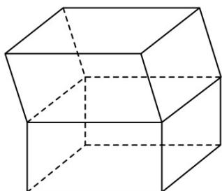

满足有两个面互相平行，其余各面都是四边形，但该几何体不是棱柱，故 $^{A}$ 不正确；

对于 $^{B}$ 中，正六棱柱中有四对互相平行的面，但只有一对面为底面，所以 $^{B}$ 不正确；

对于 $C$ 中，长方体、正方体的底面都是平行四边形，故 $C$ 不正确；

对于 $^{D}$ 中，根据棱柱的几何结构特征，可得棱柱的侧棱都相等，且侧面都是平行四边形，所以 $^{D}$ 正确。

故选：ABC.

2．如图，在长方体 $ABCD-A_{1}B_{1}C_{1}D_{1}$ 中，AB=2， $BC=BB_{1}=\sqrt{2}$ ，P 是 $B_{1}C$ 上一动点，求 $BP+PA_{1}$ 的最小值。

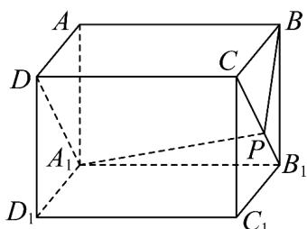

【答案】 $\sqrt{10}$

【分析】将 $\triangle BB_{1}C$ 沿 $B_{1}C$ 为轴旋转至与平面 $A_{1}B_{1}CD$ 共面，可得 $\triangle B'B_{1}C$ ，利用 $BP + PA_{1} = B'P + PA_{1}$ $B'A_{1}$ 求

解即可.

【详解】如图，将 $\triangle BB_{1}C$ 以 $B_{1}C$ 为轴旋转至与平面 $A_{1}B_{1}CD$ 共面位置，旋转后的点 $B$ 记为 $B^{\prime}$ ，由图可知 $BP + PA_{1} = B^{\prime}P + PA_{1}$ $B^{\prime}A_{1}$ ，取 $A_{1}D$ 的中点 $Q$ ，连结 $B^{\prime}Q$ ，由已知条件可知 $B^{\prime}Q = 3$ ， $A_{1}Q = 1$ ，根据勾股定理可得 $B^{\prime}A_{1} = \sqrt{10}$ ，即 $BP + PA_{1}$ 的最小值为 $\sqrt{10}$ ：

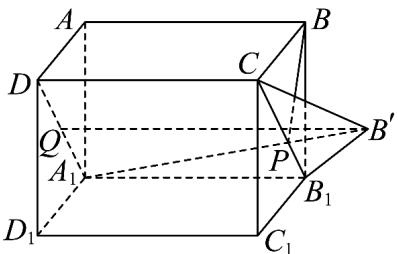

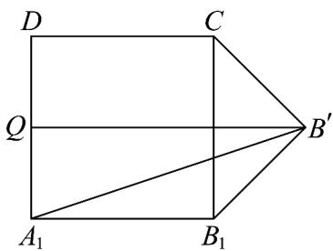

## 知识点 02 棱锥的结构特征

1、定义：有一个面是多边形，其余各面是有一个公共顶点的三角形，由这些面所围成的几何体叫做棱锥．这

个多边形面叫做棱锥的底面．有公共顶点的各个三角形叫做棱锥的侧面．各侧面的公共顶点叫做棱锥的顶点．

相邻侧面的公共边叫做棱锥的侧棱；

2、棱锥的分类：按底面多边形的边数，可以分为三棱锥、四棱锥、五棱锥……；

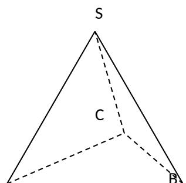

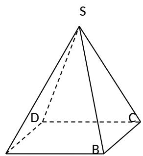

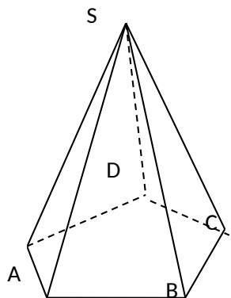

3、棱锥的表示方法：用表示顶点和底面的字母表示，如四棱锥 $S - ABCD$

知识点诠释：

棱锥有两个本质特征：

(1) 有一个面是多边形；

(2) 其余各面是有一个公共顶点的三角形，二者缺一不可。

## 【即学即练】

1. 已知三棱锥 $A - BCD$ 的棱长均为 $2$ ，点 $P$ 在 $\triangle BCD$ 内，且 $AP = \frac{2\sqrt{7}}{3}$ ，则点 $P$ 的轨迹的长度（ ） A. $\frac{1}{3}\pi$ B. $\frac{1}{2}\pi$ C. $\frac{2}{3}\pi$ D. $\pi$

【答案】C

【分析】取 $CD$ 的中点 $E$ ，连接 $BE$ ，过点 $A$ 作 $AH \perp BE$ ，垂足为 $H$ ，可求得 $P$ 在以 $H$ 为圆心， $\frac{2}{3}$ 为半径的圆

## 上，进而计算即可得答案·

【详解】如图 $^{1}$ ，取 CD 的中点 E，连接 BE，过点 A 作 $AH \perp BE$ ，垂足为 H，由 AB = 2，知 $BE = \sqrt{3}$ , $BH = \frac{2\sqrt{3}}{3}$ , $HE = \frac{\sqrt{3}}{3}$ ，所以 $AH = \sqrt{2^{2} - \left(\frac{2\sqrt{3}}{3}\right)^{2}} = \frac{2\sqrt{6}}{3}$ ，又 $AP = \frac{2\sqrt{7}}{3}$ ，
所以 $HP = \sqrt{\left(\frac{2\sqrt{7}}{3}\right)^{2} - \left(\frac{2\sqrt{6}}{3}\right)^{2}} = \frac{2}{3} > HE$ ，所以点 P 在以 H 为圆心， $\frac{2}{3}$ 为半径的圆上.
如图 $^{2}$ ，由 $BH = \frac{2\sqrt{3}}{3}$ , $HF = \frac{2}{3}$ , $\angle FBH = \frac{\pi}{6}$ ，得 $\left(\frac{2\sqrt{3}}{3}\right)^{2} + BF^{2} - 2BF \times \frac{2\sqrt{3}}{3} \times \frac{\sqrt{3}}{2} = \left(\frac{2}{3}\right)^{2}$ 解得 $BF=\frac{2}{3}$ （结合图形 $BF=\frac{4}{3}$ 舍去），所以四边形 BGHF 是菱形， $\angle GHF=\frac{\pi}{3}$ ，
所以点 P 的轨迹的长度为 $\frac{2\pi}{3}$ ·故选：C.

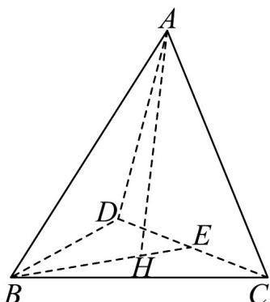
图1

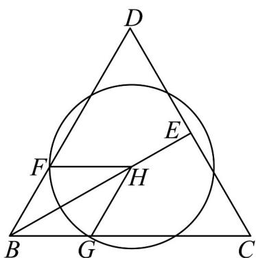
图2

2. 某果林所处的山地可近似看做一个正三棱锥 $S - ABC$ ，其中 $S$ 为山顶， $A, B, C$ 为山脚，经测量 $\angle ASB = 30^{\circ}$ ， $AB = 500\mathrm{m}$ 。为了方便果子成熟时的采摘与运输，准备从山脚 $A$ 处出发，绕山地修建一条 $3\mathrm{m}$

宽的山路，并最终从另一侧返回 $A$ 处，预计该山路的面积的最小值为（）．A. $1500\left(\sqrt{3} +1\right)\mathrm{m}^2$ B. $1000\left(\sqrt{3} +1\right)\mathrm{m}^2$ C. $500\left(\sqrt{3} +1\right)\mathrm{m}^2$ D. $6000\mathrm{m}^2$

【答案】A

【分析】通过将正三棱锥的侧面展开，利用几何关系求出山路的最短长度，再结合山路宽度求出山路面积的

最小值·

【详解】正三棱锥 S-ABC 的侧面展开图如图所示，

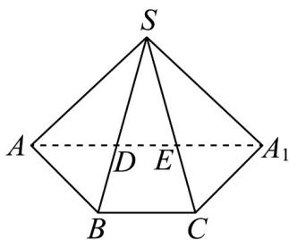

连接 $AA_{1}$ ，分别与 $SB, SC$ 交于点 $D, E$ ，则线段 $AA_{1}$ 为修建道路的长度的最小值.

因为 $\angle ASB = 30^{\circ}$ ，所以 $\angle ASA_{1} = 90^{\circ}$ ， $\angle SAA_{1} = \angle SA_{1}A = 45^{\circ}$ ， $\angle SDA = 105^{\circ}$

则 $\angle DAB = 30^{\circ}$ ， $\angle ADB = \angle ABD = 75^{\circ}$

故 $AD = AB = 500\mathrm{m}$ ，正弦定理知道 $\frac{AD}{\sin 30^{\circ}} = \frac{SA}{\sin 105^{\circ}}$ ，且 $\sin 105^{\circ} = \sin (60^{\circ} + 45^{\circ}) = \frac{\sqrt{3}}{2}\times \frac{\sqrt{2}}{2} +\frac{1}{2}\times \frac{\sqrt{2}}{2} = \frac{\sqrt{6} + \sqrt{2}}{4}$

解得 $SA = 250\left(\sqrt{6} + \sqrt{2}\right)\mathrm{m}$ 。在 $\mathrm{Rt}\triangle SA_1$ 中，解得 $AA_{1} = \frac{SA}{\sin 45^{\circ}} = 500\left(\sqrt{3} + 1\right)\mathrm{m}$

所以预计该山路的面积的最小值为 $3AA_{1}=1500\left(\sqrt{3}+1\right)\mathrm{m}^{2}$ 。故选：A.

## 知识点 03 圆柱的结构特征

1、定义：以矩形的一边所在直线为旋转轴，其余三边旋转形成的曲面所围成的几何体叫做圆柱．旋转轴叫做

圆柱的轴．垂直于轴的边旋转而成的曲面叫做圆柱的底面．平行于轴的边旋转而成的曲面叫做圆柱的侧面．

无论旋转到什么位置不垂直于轴的边都叫做圆柱的母线。

2、圆柱的表示方法：用表示它的轴的字母表示，如圆柱 $OO^{\prime}$

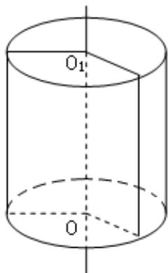

知识点诠释：

(1) 用一个平行于圆柱底面的平面截圆柱，截面是一个与底面全等的圆面。

(2) 经过圆柱的轴的截面是一个矩形，其两条邻边分别是圆柱的母线和底面直径，经过圆柱的轴的截面通常叫做轴截面。

(3) 圆柱的任何一条母线都平行于圆柱的轴.

【即学即练】

1. 如图，圆柱高 $8\mathrm{cm}$ ，底面半径 $2\mathrm{cm}$ ，一只蚂蚁从点 $A$ 爬到点 $B$ 处吃食，要爬行的最短路程为（）（ $\pi$ 取
3）

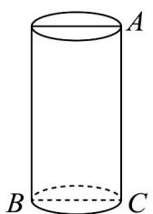

A. $10\mathrm{cm}$ B. $14\mathrm{cm}$ C. $20\mathrm{cm}$ D.无法确定

【答案】A

【分析】利用侧面展开图，结合勾股定理即可求解最短路径长·

【详解】

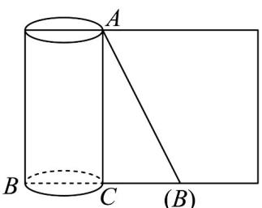

通过圆柱侧面展开图，可知最短路径为侧面展开图中的直角三角形VABC的斜边，

即 $AB = \sqrt{(2\pi)^{2} + 64} \approx \sqrt{36 + 64} = 10 \, (\text{cm})$ 故选：A.

2．如图，已知圆柱体底面圆的半径为 $\frac{2}{\pi}\mathrm{cm}$ ，高为 $2\mathrm{cm}$ ， $AB$ ， $CD$ 分别是两底面的直径， $AD$ ， $BC$ 是母线．

若一只小虫从 $A$ 点出发，从侧面爬行到 $C$ 点，则小虫爬行的最短路线的长度是（ ）cm．（结果保留根式）

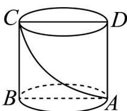

A. $\frac{2\sqrt{3}}{3}$ B. $2\sqrt{3}$ C. $2\sqrt{2}$ D. 4

【答案】C

【分析】在圆柱侧面展开图中，矩形对角线的长度即为所求·

【详解】如图，在圆柱侧面展开图中，线段 $AC_{1}$ 的长度即为所求，

在 $\mathrm{Rt}\triangle AB_1C_1$ 中， $AB_{1} = \pi \cdot \frac{2}{\pi} = 2cm$ ， $B_{1}C_{1} = 2cm$ ， $AC_{1} = 2\sqrt{2} cm$ ·故选；C

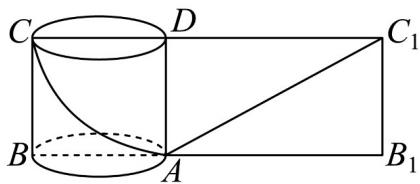

## 知识点 04 圆锥的结构特征

1、定义：以直角三角形的直角边所在直线为旋转轴，其余两边旋转而成的曲面所围成的几何体叫做圆锥．旋

转轴叫做圆锥的轴.

垂直于轴的边旋转而成的曲面叫做圆锥的底面．不垂直于轴的边旋转而成的曲面叫做圆锥的侧面．无论旋转

到什么位置不垂直于轴的边都叫做圆锥的母线.

2、圆锥的表示方法：用表示它的轴的字母表示，如圆锥 $SO$

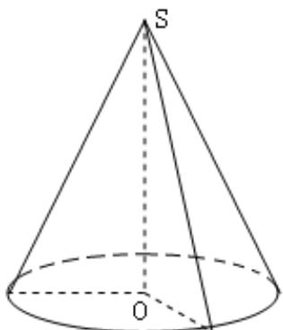

知识点诠释：

(1) 用一个平行于圆锥底面的平面去截圆锥，截面是一个比底面小的圆面。

(2) 经过圆锥的轴的截面是一个等腰三角形，其底边是圆锥底面的直径，两腰是圆锥侧面的两条母线。

（3）圆锥底面圆周上任意一点与圆锥顶点的连线都是圆锥侧面的母线.

【即学即练】

1. 如图，沿线段 $OA$ 将该圆锥的侧面剪开并展平，得到的圆锥的侧面展开图是（）

【答案】

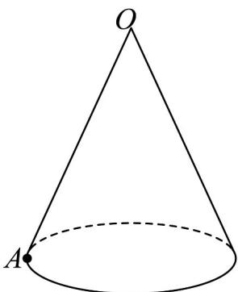

A. 三角形 B. 正方形 C. 扇形 D. 圆

【答案】C
【分析】利用圆锥侧面展开图特征判断即可·
【详解】将圆锥的侧面沿母线 $OA$ 剪开并展平，得到圆锥的侧面展开图是扇形·故选：C

2. 已知圆锥的母线长为 $2$ ，过圆锥的顶点作圆锥的截面，若截面面积的最大值为 $2$ ，则该圆锥底面半径的取值范围是（）

【答案】

A. $(0, \sqrt{2}]$ B. $(1, \sqrt{2}]$ C. $[\sqrt{2}, 2)$ D. $(0, 2)$

【答案】C

【分析】先确定截面的顶角和母线的夹角，再利用三角形面积公式得到 $\frac{\pi}{2} \leq \alpha < \pi$ ，结合轴截面的性质得到 $\sin \frac{\alpha}{2} = \frac{r}{2}$ ，进而建立不等式，求解 $r$ 的取值范围即可·

【详解】如图，设轴截面顶角为 $\alpha$ ，两个母线的夹角为 $\theta$

底面半径为 r ，且 $0 < \theta \leq \alpha < \pi$

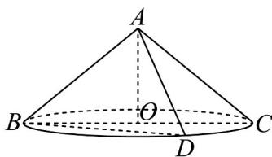

由三角形面积公式得截面面积为 $\frac{1}{2} \times 2 \times 2 \times \sin \theta = 2 \sin \theta$

若截面面积的最大值为 2，则 $2\sin\theta=2$ ，解得 $\theta=\frac{\pi}{2}$ ，

则 $\frac{\pi}{2} \leq \alpha < \pi$ ，即 $\frac{\pi}{4} \leq \frac{\alpha}{2} < \frac{\pi}{2}$ ，由轴截面的性质可得 $\sin \frac{\alpha}{2} = \frac{r}{2}$ ，

即 $\frac{\sqrt{2}}{2} \leq \frac{r}{2} < 1$ ，解得 $r \in [\sqrt{2}, 2)$ ，故 $C$ 正确.

故选：C

## 知识点 05 棱台和圆台的结构特征

1、定义：用一个平行于棱锥（圆锥）底面的平面去截棱锥（圆锥），底面和截面之间的部分叫做棱台（圆

台）；原棱锥（圆锥）的底面和截面分别叫做棱台（圆台）的下底面和上底面；原棱锥（圆锥）的侧面被截

去后剩余的曲面叫做棱台（圆台）的侧面；原棱锥的侧棱被平面截去后剩余的部分叫做棱台的侧棱；原圆锥

的母线被平面截去后剩余的部分叫做圆台的母线；棱台的侧面与底面的公共顶点叫做棱台的顶点；圆台可以

看做由直角梯形绕直角边旋转而成，因此旋转的轴叫做圆台的轴。

2、棱台的表示方法：用各顶点表示，如四棱台 $ABCD - A_{1}B_{1}C_{1}D_{1}$ ；

3、圆台的表示方法：用表示轴的字母表示，如圆台 $OO'$ ；

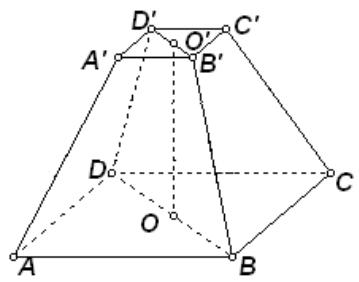

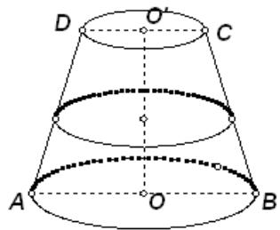

知识点诠释：

(1) 棱台必须是由棱锥用平行于底面的平面截得的几何体．所以，棱台可还原为棱锥，即延长棱台的所有侧

棱，它们必相交于同一点。

(2)棱台的上、下底面是相似的多边形，它们的面积之比等于截去的小棱锥的高与原棱锥的高之比的平方.

（3）圆台可以看做由圆锥截得，也可以看做是由直角梯形绕其直角边旋转而成.

(4) 圆台的上、下底面的面积比等于截去的小圆锥的高与原圆锥的高之比的平方.

## 【即学即练】

1. 如图，四棱台的两底面是正方形，侧面是全等的等腰梯形·若该棱台的侧棱 $AA_{1} = 20$ ，下底面ABCD的边

$$
\frac {\sqrt {6}}{3}
$$

长为 $^{5}$ ，下底面所在平面与侧面所在平面的夹角的正弦值为 3，则上底面 $A_{1}B_{1}C_{1}D_{1}$ 的边长为（）

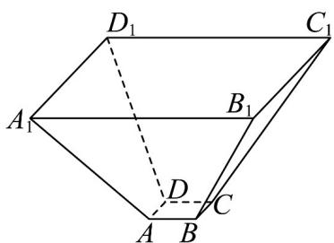

A. 15 B. $5 + 10\sqrt{2}$ C. 25 D. $5 + 20\sqrt{2}$

【答案】C

【分析】由题可知四棱台为正棱台，设上底边长为 $x$ ，在侧面中可得斜高 $MF = \sqrt{20^2 - \left(\frac{x - 5}{2}\right)^2}$ ，再由正四棱

台的特性可知 $\angle FMN$ 就是下底面所在平面与侧面所在平面夹角的平面角，得到

$\cos \angle EFM = \frac{FG}{MF} = \frac{\frac{x - 5}{2}}{\sqrt{20^2 - \left(\frac{x - 5}{2}\right)^2}} = \frac{\sqrt{3}}{3}$ ，解方程即可得到上底边长·

【详解】根据题意，四棱台为正棱台，设 $AD, BC, B_{1}C_{1}, A_{1}D_{1}$ 中点为 M, N, E, F ，上底边长为 x ，

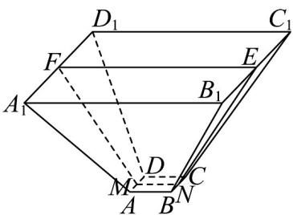

在侧面 $AA_{1}D_{1}D$ 中， $MF$ 为斜高，又 $AD = 5, AA_{1} = 20$ ，所以 $MF = \sqrt{20^{2} - \left(\frac{x - 5}{2}\right)^{2}}$

在正棱台中， $MN \perp AD, MF \perp AD$

所以 $\angle FMN$ 就是下底面所在平面与侧面所在平面夹角的平面角，

在四边形MNEF中， $\angle EFM + \angle FMN = \pi$ ，则 $\sin\angle EFM = \frac{\sqrt{6}}{3},\cos\angle EFM = \frac{\sqrt{3}}{3}$

过 $M$ 作 $MG \perp EF$ 交 $EF$ 于 $G$

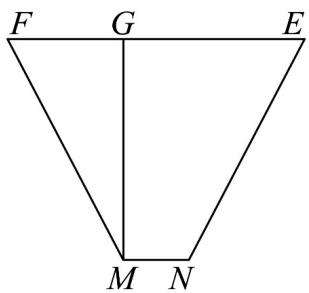

所以 $\cos\angle EFM=\frac{FG}{MF}=\frac{\frac{x-5}{2}}{\sqrt{20^{2}-\left(\frac{x-5}{2}\right)^{2}}}=\frac{\sqrt{3}}{3}$

解得 $\frac{x - 5}{2} = 10 \Rightarrow x = 25$ ，即上底边长为 $^{25}$ . 故选：C.

2. 某工厂生产出一种机械零件，如图所示，零件的几何结构为圆台 $O_{1}O_{2}$ ，在轴截面 $ABCD$ 中， $AB = AD = BC = 4\mathrm{cm}, CD = 2AB$

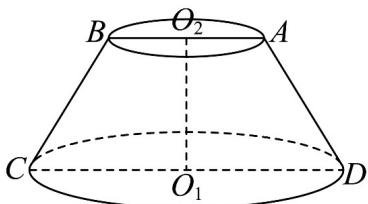

(1)求圆台 $O_{1}O_{2}$ 的高；

(2)求圆台 $O_{1}O_{2}$ 轴截面的面积；

(3)若一只蚂蚁从点 $C$ 沿着该圆台的侧面爬行到 $AD$ 的中点，求所经过的最短路程.

【答案】(1) $2\sqrt{3}cm$ ;

(2) $12\sqrt{3}cm^{2}$

(3)10cm

【分析】（1）作 $BE \perp CD$ 交CD于E，利用勾股定理求解即可；

(2) 利用梯形的面积公式求解；

(3) 把空间图形展开为平面图形，先求出圆心角，再利用两点间的距离最短即可求解.

【详解】（1）如图1，作 $BE \perp CD$ 交CD于E，

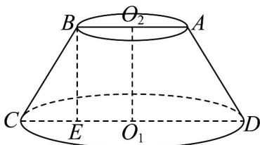
图1

易得 $CE = \frac{CD - AB}{2} = 2cm$ ，

则 $O_{1}O_{2} = BE = \sqrt{4^{2} - 2^{2}} = 2\sqrt{3}\mathrm{cm}$ ，则圆台的高为 $2\sqrt{3}\mathrm{cm}$

(2) 圆台的轴截面面积为： $\frac{1}{2}\times(4+8)\times2\sqrt{3}=12\sqrt{3}cm^{2}$

(3) 把圆台补成圆锥可得大圆锥的母线长为 $8 \mathrm{~cm}$ , 底面半径为 $4 \mathrm{~cm}$

圆锥侧面展开图的圆心角为 $\theta = \frac{2\pi \times 4}{8} = \pi$

设 AD 的中点为 P，连接 CP（如图 2），

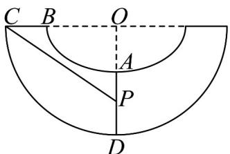
图2

可得 $\angle COP = \frac{\pi}{2}, OC = 8\mathrm{cm}, OP = 4 + 2 = 6(\mathrm{cm})$ ，则 $CP = \sqrt{6^2 + 8^2} = 10\mathrm{cm}$ ，

所以沿着该圆台表面从点 C 到 AD 中点的最短距离为 10cm

## 知识点 06 球的结构特征

1、定义：以半圆的直径所在直线为旋转轴，半圆面旋转一周形成的几何体叫做球体，简称球．半圆的半径叫

做球的半径．半圆的圆心叫做球心．半圆的直径叫做球的直径．

2、球的表示方法：用表示球心的字母表示，如球 $O$ ：

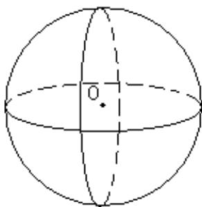

知识点诠释：

（1）用一个平面去截一个球，截面是一个圆面．如果截面经过球心，则截面圆的半径等于球的半径；如果截
面不经过球心，则截面圆的半径小于球的半径．

(2) 若半径为 $R$ 的球的一个截面圆半径为 $r$ ，球心与截面圆的圆心的距离为 $d$ ，则有 $d = \sqrt{R^2 - r^2}$ 【即学即练】

1. 已知正四棱锥 $P - ABCD$ 的底面边长为 2，侧棱长为 $\sqrt{5}$ ，外接球的球心为 $O$ ，若点 $S$ 是正四棱锥 $P - ABCD$ 的表面上的一点，则 $OS$ 的最小值为（）

【答案】

A. $\frac{5\sqrt{3}}{12}$ B. $\frac{\sqrt{3}}{6}$ C. $\sqrt{2}$ D. 1

【答案】B

【分析】利用勾股定理求出外接球的半径 R，然后根据图形求解 OS 的最小值·

【详解】设 $AC \cap BD = E$ ，连接 PE，则 $PE \perp$ 平面 ABCD，

依题意可得 $AC = \sqrt{2^2 + 2^2} = 2\sqrt{2}$ ， $AE = \frac{1}{2} AC = \sqrt{2}$

所以 $PE = \sqrt{\left(\sqrt{5}\right)^{2} - \left(\sqrt{2}\right)^{2}} = \sqrt{3}$ ，且球心 O 在直线 PE 上，

连接 AO，设外接球的半径为 R，则 $R^{2}=\left(\sqrt{2}\right)^{2}+\left(R-\sqrt{3}\right)^{2}$ ，解得 $R=\frac{5\sqrt{3}}{6}$

因为 $R=\frac{5\sqrt{3}}{6}<\sqrt{3}$ ，故球心 O 在线段 PE 上，

又 $S$ 是正四棱锥 $P - ABCD$ 的表面上的一点， $OS$ 的最小值即球心 $O$ 到平面 $ABCD$ 的距离 $OE$

且 $|OE| = |PE| - R = \frac{\sqrt{3}}{6}$

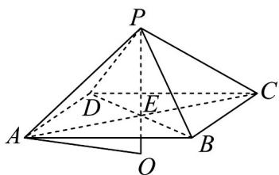

故选：B

2. 在三棱锥 $A - BCD$ 中， $AB \perp$ 平面 $BCD$ ， $BC \perp CD$ ， $AB = BC = 1$ ， $BD = \sqrt{2}$ ，三棱锥 $A - BCD$ 的所有顶

点均在球 $O$ 的表面上，若点 $M$ 、 $N$ 分别为 $\triangle BCD$ 与 $\triangle ABD$ 的重心，直线 $MN$ 与球 $O$ 的表面相交于 $F$ 、 $G$ 两

点，则 $\left|FG\right|\left|MN\right|=\underline{\quad}$

【答案】 $2 \sqrt{3}$

【分析】将三棱锥 A-BCD 放入边长为 $^{1}$ 的正方体中，故三棱锥的外接球球心即为正方体的中心 O，且 O 为

$AD$ 的中点，作出辅助线，得到 $MN = \frac{1}{3} AC$ ，外接球半径为 $r = \frac{\sqrt{3}}{2}$ ，由勾股定理逆定理得到 $NO_{\perp}MN$ ，求出

点 O 到直线 MN 的距离，从而求出 $\left|FG\right|=2\sqrt{r^{2}-ON^{2}}=\frac{2\sqrt{6}}{3}$ ，从而得到答案

【详解】如图所示，将三棱锥 A-BCD 放入边长为 $^{1}$ 的正方体中，

故三棱锥的外接球球心即为正方体的中心 $O$ ，且 $O$ 为 $AD$ 的中点，

取 $CD$ 的中点 $E$ ， $BD$ 的中点 $G$ ，连接 $BE$ ， $CG$ ，则 $BE$ 与 $CG$ 的交点即为 $M$ ，

连接 BO，AG，则 BO 与 AG 的交点即为 N，连接 OE，

因为 $\frac{BN}{BO} = \frac{BM}{BE} = \frac{2}{3}$ ，所以 $MN //OE$ ，且 $MN = \frac{2}{3} OE$ ，

连接 $AC$ ，则 $OE // AC$ ，且 $OE = \frac{1}{2} AC$ ，故 $MN = \frac{2}{3} \times \frac{1}{2} AC = \frac{1}{3} AC$

因为 $AB = BC = 1$ ，所以 $AC = \sqrt{2}$ ，所以 $OE = \frac{\sqrt{2}}{2}$ ， $MN = \frac{\sqrt{2}}{3}$

又 $CE=\frac{1}{2}$ ，由勾股定理得 $BE=\sqrt{BC^{2}+CE^{2}}=\frac{\sqrt{5}}{2}$

$$
B D = \sqrt {B C ^ {2} + C D ^ {2}} = \sqrt {2} A D = \sqrt {B D ^ {2} + A B ^ {2}} = \sqrt {3}
$$

故外接球半径为 $r=\frac{1}{2}AD=\frac{\sqrt{3}}{2}$ ，故 $BO=\frac{\sqrt{3}}{2}$

因为 $BO^{2} + OE^{2} = BE^{2}$ ，由勾股定理逆定理得 $BO_{\perp}OE$

则 $NO_{\perp}MN$ ，故点 $O$ 到直线 $MN$ 的距离为 $ON = \frac{1}{3} OB = \frac{\sqrt{3}}{6}$

则 $\left|FG\right|=2\sqrt{r^{2}-ON^{2}}=\frac{2\sqrt{6}}{3}$ ，故 $\left|FG\right|\left|MN\right|=\frac{2\sqrt{6}}{3}:\frac{\sqrt{2}}{3}=2\sqrt{3}$

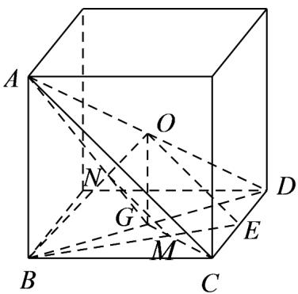

故答案为： $2\sqrt{3}$

## 知识点 07 简单组合体的结构特征

1、组合体的基本形式：①由简单几何体拼接而成的简单组合体；②由简单几何体截去或挖去一部分而成的几

何体；

2、常见的组合体有三种：①多面体与多面体的组合；②多面体与旋转体的组合；③旋转体与旋转体的组合。

① 多面体与多面体的组合体：由两个或两个以上的多面体组成的几何体称为多面体与多面体的组合体．如下

图（1）是一个四棱柱与一个三棱柱的组合体；如图（2）是一个四棱柱与一个四棱锥的组合体；如图（3）是

一个三棱柱与一个三棱台的组合体．

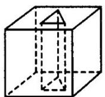
(1)

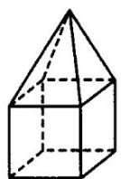
(2)

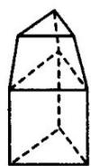
(3)

② 多面体与旋转体的组合体：由一个多面体与一个旋转体组合而成的几何体称为多面体与旋转体的组合体如

图（1）是一个三棱柱与一个圆柱组合而成的；如图（2）是一个圆锥与一个四棱柱组合而成的；而图（3）是

一个球与一个三棱锥组合而成的．

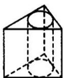

(1)

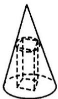

(2)

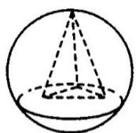

(3)

③旋转体与旋转体的组合体：由两个或两个以上的旋转体组合而成的几何体称为旋转体与旋转体的组合体。

如图（1）是由一个球体和一个圆柱体组合而成的；如图（2）是由一个圆台和两个圆柱组合而成的；如图

(3) 是由一个圆台、一个圆柱和一个圆锥组合而成的.

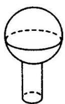

(1)

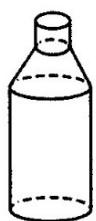

(2)

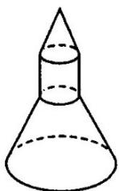

(3)

## 【即学即练】

1. 如图，三个半径都是 $6$ 的球 $O_{1}$ ，球 $O_{2}$ ，球 $O_{3}$ 放在一个半球面的碗（碗的厚度不计）中，球 $O_{1}$ ，球 $O_{2}$

球 $O_{3}$ 两两外切，并且球 $O_{1}$ ，球 $O_{2}$ ，球 $O_{3}$ 的顶端恰好与碗的上沿处于同一水平面，碗的半径是 $R$ ，又有一个

半径为 $r$ 的球 $O_{4}$ 与球 $O_{1}$ ，球 $O_{2}$ ，球 $O_{3}$ 均外切，并且球 $O_{4}$ 的顶端也恰好与碗的上沿处于同一水平面，则

$R + r =$

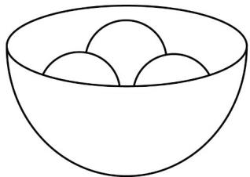

【答案】 $8+2\sqrt{21}$

【分析】根据题意，设三个球心在碗面的投影为 A, B, C ，碗面中心为 O ，则构成正三棱柱 $O_{1}O_{2}O_{3}-ABC$ ，在

正三棱柱中利用勾股定理构建方程可求 r = 2 ，再根据相切可得 $R = OO_{1} + 6 = 6 + 2\sqrt{21}$ 即可求解.

【详解】根据题意，设三个球心在碗面的投影为 $A, B, C$ ，碗面中心为 $O$

则构成如图正三棱柱 $O_{1}O_{2}O_{3}-ABC$ ，底面边长为 12，高 $O_{1}A=6$

过 $O_{4}$ 作 $O_{4}D \perp O_{1}A$ ，交 $O_{1}A$ 于 D，

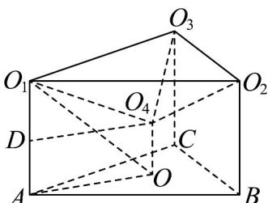

则 $DO_{4} = AO = 4\sqrt{3}$ ， $O_{1}D = 6 - r$ ， $O_{1}O_{4} = 6 + r$

又 $O_{4}D \perp O_{1}A$ ，所以 $\left(6 - r\right)^{2} + \left(4\sqrt{3}\right)^{2} = \left(6 + r\right)^{2}$ ，解得 $r = 2$ ，

又球 $O_{1}$ ，球 $O_{2}$ ，球 $O_{3}$ 与半球面相切， $OO_{1} = 2\sqrt{21}$ ，所以 $R = OO_{1} + 6 = 6 + 2\sqrt{21}$

则 $R + r = 8 + 2\sqrt{21}$ .

故答案为： $8+2\sqrt{21}$

2. 某广场设置了一些石凳供大家休息，如图，每个石凳都是由正方体截去八个相同的正三棱锥得到的几何体。

则下列结论不正确的是（）

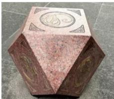

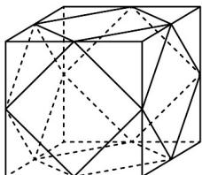

A. 该几何体有 $6$ 个面是正方形
B. 该几何体有 $8$ 个面是正三角形
C. 该几何体恰有 $26$ 条棱
D. 该几何体的表面积比原正方体的表面积小

【答案】C

【分析】根据截取的几何体形状可判断 $^{AB}$ 正确，再根据正方体每个表面的棱长可判断 $^{C}$ 错误，

【详解】对于 A，B，因为正方体截去八个正三棱锥，所以比原正方体多出八个正三角形，

原来的六个表面还是正方形，所以 A，B 正确。

对于 $C$ ，因为原正方体每个表面均有四条棱，所以该几何体共有 $^{24}$ 条棱， $C$ 不正确。

对于 D，不妨取正方体的棱长为 $^{2}$ ，截去的每个正三棱锥的侧面面积为 $3 \times \frac{1}{2} \times 1 \times 1 = \frac{3}{2}$

而它的底面积是边长为 $\sqrt{2}$ 的正三角形，其面积为 $\frac{1}{2} \times \left(\sqrt{2}\right)^2 \times \frac{\sqrt{3}}{2} = \frac{\sqrt{3}}{2} < \frac{3}{2}$

即截去的每个正三棱锥的侧面面积比它的底面面积大，所以 $^{D}$ 正确。

故选：C

## 知识点 08 几何体中的计算问题

几何体的有关计算中要注意下列方法与技巧：

(1) 在正棱锥中，要掌握正棱锥的高、侧面、等腰三角形中的斜高及高与侧棱所构成的两个直角三角形，有

关证明及运算往往与两者相关．

(2) 正四棱台中要掌握其对角面与侧面两个等腰梯形中关于上、下底及梯形高的计算，有关问题往往要转化

到这两个等腰梯形中．另外要能够将正四棱台、正三棱台中的高与其斜高、侧棱在合适的平面图形中联系起

来.

(3) 研究圆柱、圆锥、圆台等问题的主要方法是研究它们的轴截面，这是因为在轴截面中，易找到所需有关

元素之间的位置、数量关系.

（4）圆柱、圆锥、圆台的侧面展开是把立体几何问题转化为平面几何问题处理的重要手段之一.

(5) 圆台问题有时需要还原为圆锥问题来解决.

(6) 关于球的问题中的计算，常作球的一个大圆，化“球”为“圆”，应用平面几何的有关知识解决；关于球与

多面体的切接问题，要恰当地选取截面，化“空间”为平面。

【即学即练】

1. 如图，已知四棱锥 $V - ABCD$ 的底面是面积为16的正方形ABCD，侧面是全等的等腰三角形，一条侧棱长

为 $6\sqrt{2}$ .

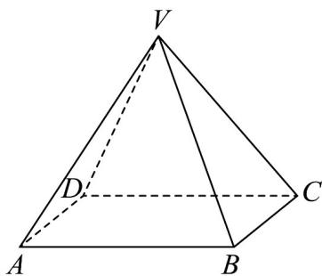

(1)计算四棱锥 V - ABCD 的高；

(2)计算四棱锥 V-ABCD 侧面三角形底边上的高.

【答案】(1)8

(2) $2\sqrt{17}$

【分析】（ $^{1}$ ）根据正四棱锥的知识求得几何体的高·

(2) 根据等腰三角形的知识求得侧面三角形底边上的高·

【详解】（1）正方形ABCD的边长为 $\sqrt{16} = 4$

由于四棱锥的侧面是全等的等腰三角形，

所以四棱锥是正四棱锥，设 $AC \cap BD = O$ ，连接 VO，

则 $VO \perp$ 平面ABCD，由于 $AC \subset$ 平面ABCD

所以 $VO \perp AC$ ，由于 $AC = 4\sqrt{2}, OC = 2\sqrt{2}$

所以 $VO = \sqrt{(6\sqrt{2})^{2} - (2\sqrt{2})^{2}} = \sqrt{72 - 8} = 8$

即四棱锥 V - ABCD 的高为 8.

(2) 由于正四棱锥的侧面是全等的等腰三角形，

侧面三角形底边上的高为 $\sqrt{\left(6\sqrt{2}\right)^2 - \left(\frac{4}{2}\right)^2} = \sqrt{72 - 4} = 2\sqrt{17}$

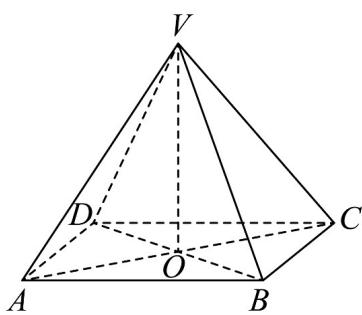

2. 十月一日是国庆节，也是小明爸爸的生日，小明到商店买了一个生日蛋糕和家人一起庆祝。卖蛋糕的售货

员说，商店有图①和图②两种捆扎方式供你选择，但捆扎用的彩带要根据带子的长度另外付费．你选择哪种

捆扎方式？小明经过计算，很快作出了自己的选择．售货员听后直夸小明聪明．说，你选择的捆扎方式比另

一种所用的彩带短，所需的费用少，那么，小明选择的捆扎方式是\_\_\_\_（注：填图①或图②）.

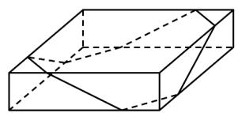
①

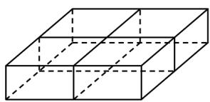
②

【答案】图①

【分析】根据给定几何体，设出其相应的棱长，表示出两种捆扎方式所用彩带长度，比较大小作答

【详解】由给定的几何体及生活实际知，蛋糕盒是正四棱柱，设其底面正方形边长为 $a$ ，高为 $b$

图②所用彩带总长为 $4(a + b)$ ，对于图①，令彩带与包装盒的棱的部分公共点如图，过 E 作 EF // GH 交 AC 于 F，由图①的几何体及对称性知， $AB = AC = EH = FG$ ，则彩带总长为 $4(BC + CE)$ ，显然 $BC + CE < (AB + AC) + (CF + EF) = AC + CF + FG + b = a + b$ ，于是得 $4(BC + CE) < 4(a + b)$ ，

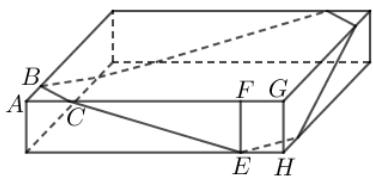

所以图①所用彩带总长比图②所用彩带总长短，所需的费用少

故答案为：图①

## 题型精讲

![[高中/课堂同步/题库/人教A版高中数学同步讲义(2026)/02_必修第二册/第八章 立体几何初步/专题8.1 基本立体图形（高效培优讲义）/题型01_简单几何体的结构特征/题型01_简单几何体的结构特征.md]]
![[高中/课堂同步/题库/人教A版高中数学同步讲义(2026)/02_必修第二册/第八章 立体几何初步/专题8.1 基本立体图形（高效培优讲义）/题型02_几何体中的基本计算/题型02_几何体中的基本计算.md]]
![[高中/课堂同步/题库/人教A版高中数学同步讲义(2026)/02_必修第二册/第八章 立体几何初步/专题8.1 基本立体图形（高效培优讲义）/题型03_简单几何体的组合体/题型03_简单几何体的组合体.md]]
![[高中/课堂同步/题库/人教A版高中数学同步讲义(2026)/02_必修第二册/第八章 立体几何初步/专题8.1 基本立体图形（高效培优讲义）/题型04_简单几何体的表面展开与折叠问题/题型04_简单几何体的表面展开与折叠问题.md]]
![[高中/课堂同步/题库/人教A版高中数学同步讲义(2026)/02_必修第二册/第八章 立体几何初步/专题8.1 基本立体图形（高效培优讲义）/强化训练/强化训练.md]]
