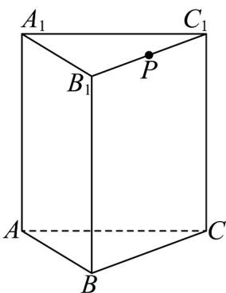

<!-- question-source:start -->
4．如图，在直三棱柱 $ABC-A_{1}B_{1}C_{1}$ 中， $A_{1}B_{1}\perp A_{1}C_{1}$ ， $AB=AC=AA_{1}=4$ ，点 P 为棱 $B_{1}C_{1}$ 的中点，则点 P 到直

线 $AB$ 的距离为（）

A. $2\sqrt{5}$ B. $2\sqrt{6}$ C. $3\sqrt{2}$ D. $2\sqrt{3}$
<!-- question-source:end -->

![[高中/课堂同步/题库/人教A版高中数学同步讲义(2026)/02_必修第二册/第八章 立体几何初步/专题8.1 基本立体图形（高效培优讲义）/强化训练/questions/answers/Q00078195A1.md]]
