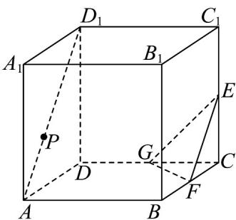

<!-- question-source:start -->
9. 如图，在棱长为 $^{1}$ 的正方体 $ABCD-A_{1}B_{1}C_{1}D_{1}$ 中，点F，G分别是CB，CD的中点，E在棱 $CC_{1}$ 上满足

$CE = kCC_{1}$ ， $k\in [0,1]$ ， $P$ 为线段 $AD_{1}$ 上的一个动点，平面 $\alpha //$ 平面 $EFG$ ，则下列命题中正确的是（）

A. 当 $k = \frac{1}{2}$ 时， $AD_{1} //$ 平面 EFG

B．当 $\frac{3}{4} < k < 1$ 时，过点 $A$ ， $F$ ， $E$ 的平面截该正方体所得的截面为五边形

C. 当 $k = \frac{1}{2}$ 时，平面 $\alpha$ 截该正方体所得截面面积的最大值为 $\frac{\sqrt{3}}{2}$

D. 当 $k = \frac{1}{2}$ 时， $PF + PG$ 的最小值为 $\frac{\sqrt{8 + 3\sqrt{6}}}{2}$
<!-- question-source:end -->

![[高中/课堂同步/题库/人教A版高中数学同步讲义(2026)/02_必修第二册/第八章 立体几何初步/专题8.1 基本立体图形（高效培优讲义）/强化训练/questions/answers/Q00078198A1.md]]
