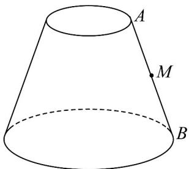

<!-- question-source:start -->
10．如图所示，圆台母线 $AB$ 长为 $20\mathrm{cm}$ ，上、下底面半径分别为 $5\mathrm{cm}$ ， $10\mathrm{cm}$ ，从母线 $AB$ 的中点 $M$ 拉一条绳

子绕圆台侧面一周转到点 B .

(1)求这条绳长的最小值；

(2)求绳长最短时，圆台上底面圆周上的点到绳子的最短距离.
<!-- question-source:end -->

![[高中/课堂同步/题库/人教A版高中数学同步讲义(2026)/02_必修第二册/第八章 立体几何初步/专题8.1 基本立体图形（高效培优讲义）/强化训练/questions/answers/Q00078199A1.md]]
