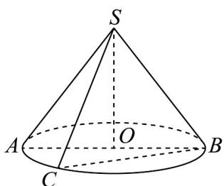

<!-- question-source:start -->
11. 用一个过圆锥的轴的平面去截圆锥，所得的截面三角形称为圆锥的轴截面，也称为圆锥的子午三角形·如

图，圆锥 SO 底面圆的半径是 $^{4}$ ，轴截面 SAB 的面积是 $^{4}$ .

(1)求圆锥 $SO$ 的母线长；

(2) 过圆锥 $SO$ 的两条母线 $SB$ ， $SC$ 作一个截面，求截面 $SBC$ 面积的最大值。
<!-- question-source:end -->

![[高中/课堂同步/题库/人教A版高中数学同步讲义(2026)/02_必修第二册/第八章 立体几何初步/专题8.1 基本立体图形（高效培优讲义）/强化训练/questions/answers/Q00078200A1.md]]
