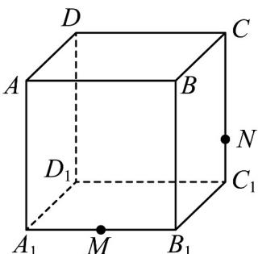

<!-- question-source:start -->
12．如图，正方体 $ABCD - A_{1}B_{1}C_{1}D_{1}$ 的棱长为 6，M 是 $A_{1}B_{1}$ 的中点，点 N 在棱 $CC_{1}$ 上，且 $CN = 2NC_{1}$ .

(1)作出过点 D, M, N 的平面截正方体 $ABCD - A_{1}B_{1}C_{1}D_{1}$ 所得的截面，写出作法；

(2)求 $(1)$ 中所得截面的周长·
<!-- question-source:end -->

![[高中/课堂同步/题库/人教A版高中数学同步讲义(2026)/02_必修第二册/第八章 立体几何初步/专题8.1 基本立体图形（高效培优讲义）/强化训练/questions/answers/Q00078201A1.md]]
