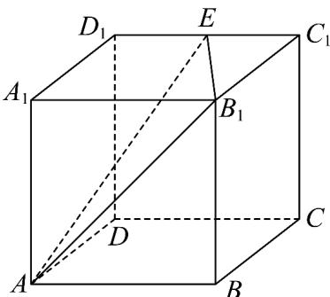
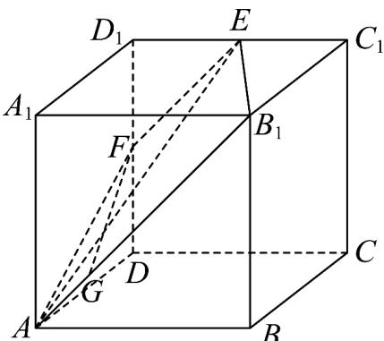

> [!faq]- 《专题8.1 基本立体图形（高效培优讲义）》官方解析
>
> > [!success]- **【答案】**  A. $9\sqrt{2}$ B.18 C. $18\sqrt{2}$ D.36
>
> > [!note]- **【分析】**
> > 取 $DD_{1}$ 的中点 F ，连接 EF ，得平面 $AB_{1}EF$ 为平面 $AB_{1}E$ 截正方体的截面，由梯形的面积公式即可求
> >
> > 解·
>
> > [!note]- **【解析】**
> > 取 $DD_{1}$ 的中点F，连接EF，易知 $EF\parallel DC_{1}\parallel AB_{1}$ ，所以平面 $AB_{1}E$ 与 $DD_{1}$ 交点为F，
> >
> > 则平面 $AB_{1}EF$ 为平面 $AB_{1}E$ 截正方体的截面，四边形 $AB_{1}EF$ 为等腰梯形，
> >
> > 过 F 做 $FG \perp AB_{1}$ ，由 $AB = AD = B_{1}C_{1} = BB_{1} = 4$ ， $D_{1}F = D_{1}E = 2$ ，
> >
> > 所以 $AB_{1}=\sqrt{AB^{2}+BB_{1}^{2}}=4\sqrt{2}$ ， $EF=\sqrt{D_{1}E^{2}+D_{1}F^{2}}=2\sqrt{2}$
> >
> > $$
> > A F = B _ {1} E = \sqrt {4 ^ {2} + 2 ^ {2}} = 2 \sqrt {5} \quad F G = \sqrt {2 0 - 2} = 3 \sqrt {2},
> > $$
> >
> > 所以其面积为 $S=\frac{1}{2}(EF+AB_{1})\cdot FG=\frac{1}{2}\times(2\sqrt{2}+4\sqrt{2})\times3\sqrt{2}=18$
> >
> > 故选：B.
> >
> > 
