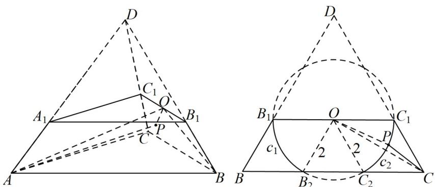

> [!faq]- 《专题8.1 基本立体图形（高效培优讲义）》官方解析
>
> > [!success]- **【答案】** A. 点 $A$ 到平面 $BCC_{1}B_{1}$ 的距离为 $2\sqrt{6}$ B. 曲线 $\Gamma$ 的长度为 $4\pi$ C. 线段 $CP$ 的最小值为 $2\sqrt{3} - 2$ D. 所有线段 $AP$ 所形成的曲面面积为 $\frac{4\sqrt{7}\pi}{3}$
>
> > [!note]- **【分析】**
> > 根据正四面体的性质进行计算，可判定 $^{A}$ ；结合球的性质研究得到曲线 $\Gamma$ 为正 $\triangle PBC$ 的以中心中心
> >
> > $O_{为圆心半径为2的圆在梯形}BCC_{1}B_{1}$ 内的部分，为两段圆弧，进而判定 BCD.
>
> > [!note]- **【解析】**
> > 设截得已知三棱台的正四面体为 $ABCD$ ，根据正四面体的性质，点 $A$ 到平面 $BCC_{1}B_{1}$ 的距离 $AO \perp$ 平
> >
> > 面 $BCC_{1}B_{1}$ ，垂足为 O，
> >
> > $AO=\sqrt{AB^{2}-OB^{2}}=\sqrt{6^{2}-\left(\frac{2}{3}\times6\times\frac{\sqrt{3}}{2}\right)^{2}}=2\sqrt{6}$ ，A选项正确；
> >
> > 以点 A 为球心， $2\sqrt{7}$ 为半径的球面与侧面 $BCC_{1}B_{1}$ 的交线为曲线 $\Gamma$ ，P 为 $\Gamma$ 上一点，则
> >
> > $$
> > O P = \sqrt {A P ^ {2} - A O ^ {2}} = \sqrt {\left(2 \sqrt {7}\right) ^ {2} - \left(2 \sqrt {6}\right) ^ {2}} = 2
> > $$
> >
> > 点 $P$ 轨迹为以正 $\triangle DBC$ 中心 $O$ 为圆心半径为 $^2$ 的圆在梯形 $BCC_{1}B_{1}$ 内的部分，为两段圆弧 $c_{1}, c_{2}$ ，每一段的圆
> >
> > 心角都是 $\frac{\pi}{3}$ ，端点都是正 $\triangle DBC$ 边的三等分点，如图所示·
> >
> > 
> >
> > 曲线 $\Gamma$ 的长度为 $2\times \left(\frac{\pi}{3}\times 2\right) = \frac{4\pi}{3}$ ，B选项错误；
> >
> > 连接 OP, OC，由圆的性质可得线段 CP 的最小值 $OC - OP = \frac{\sqrt{3}}{2} \times 6 \times \frac{2}{3} - 2 = 2\sqrt{3} - 2$ ，C 选项正确；
> >
> > 所有线段 $AP$ 所形成的曲面是以 $A$ 为顶点，圆 $O$ 为底面的圆锥的侧面的了 $^2$ 小部分，其面积为面积
> >
> > $\frac{1}{2} \times \frac{4\pi}{3} \times 2\sqrt{7} = \frac{4\sqrt{7}\pi}{3}$ ，D选项正确·
> >
> > 故选 **ACD**
