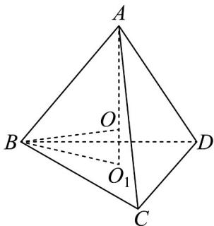
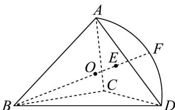
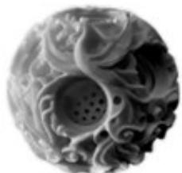
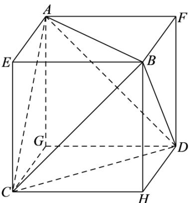

> [!faq]- 《专题8.1 基本立体图形（高效培优讲义）》官方解析
>
> > [!success]- **【答案】** A $$ A B C - A _ {1} B _ {1} C _ {1} $$
>
> > [!note]- **【分析】**
> > 先利用正四面体的高以及外接球半径与棱长的关系，得到外接球半径，再根据图形得到勒洛四面体
> >
> > 的内切球半径即为该勒洛四面体的能够容纳的最大球的半径·
>
> > [!note]- **【解析】**
> > 勒洛四面体能够容纳的最大球与勒洛四面体的 $^{4}$ 个弧面都相切，即为勒洛四面体内切球，
> >
> > 由对称性知，勒洛四面体ABCD内切球球心是正四面体ABCD的内切球、外接球球心 $O$ ，如图：
> >
> > 
> >
> > 正 $\triangle BCD$ 外接圆半径 $O_{1}B = \frac{2}{3}\times a\cdot \cos 30^{\circ} = \frac{\sqrt{3}}{3} a$
> >
> > 正四面体 $ABCD$ 的高 $AO_{1} = \sqrt{AB^{2} - O_{1}B^{2}} = \frac{\sqrt{6}}{3} a$ ，令正四面体 $ABCD$ 的外接球半径为 $R$ ，
> >
> > 在 $\mathrm{Rt}\triangle BOO_1$ 中， $R^2 = OO_1^2 +BO_1^2 = \left(\frac{\sqrt{6}}{3} a - R\right)^2 +\left(\frac{\sqrt{3}}{3} a\right)^2$ ，解得 $R = \frac{\sqrt{6}}{4} a$
> >
> > 此时我们再次完整地抽取部分勒洛四面体如图所示：
> >
> > 
> >
> > 图中取正四面体 ABCD 中心为 O，连接 BO 交平面 ACD 于点 E，交曲面 ACD 于点 F，
> >
> > 其中 BO 即为正四面体外接球半径 $R = \frac{\sqrt{6}}{4} a$
> >
> > 因为点 $ACDF$ 均在以点 $B$ 为球心的球面上，所以 $BF = AB = a$
> >
> > 设勒洛四面体内切球半径为 $r$ ，则由图得 $r = OF = BF - BO = AB - BO = a - \frac{\sqrt{6}}{4} a = \left(1 - \frac{\sqrt{6}}{4}\right)a.$
> >
> > 故答案为： $\left(1 - \frac{\sqrt{6}}{4}\right)a$
> >
> > 6. 中国雕刻技艺举世闻名，雕刻技艺的代表作“鬼工球”，取鬼斧神工的意思，制作相当繁复，成品美轮美奂
> >
> > 1966年，玉石雕刻大师吴公炎将这一雕刻技艺应用到玉雕之中，他把玉石镂成多层圆球，层次重叠，每层都
> >
> > 可灵活自如的转动，是中国玉雕工艺的一个重大突破·今一雕刻大师在棱长为 $^{10}$ 的整块正方体玉石内部套雕
> >
> > 出一个可以任意转动的球，在球内部又套雕出一个正四面体（所有棱长均相等的三棱锥），若不计各层厚度和
> >
> > 损失，则最内层正四面体的棱长最长为
> >
> > 
> >
> > 【答案】 $\frac{10\sqrt{6}}{3}/\frac{10}{3}\sqrt{6}$
> >
> > 【分析】求出求的半径，将正四面体 ABCD 补成正方体 AEBF-GCHD，设正四面体 ABCD 的棱长为 a，可
> >
> > 得出正方体 $AEBF - GCHD$ 的棱长为 $\frac{\sqrt{2}}{2} a$ ，利用正方体的体对角线长小于等于球的直径可得出关于 $a$ 的不等
> >
> > 式，即可求得 $a$ 的最大值·
> >
> > 【详解】由题意可知，球为棱长为10的内切球，则该球的半径为5，
> >
> > 设正四面体 $ABCD$ 的棱长为 $a$ ，将正四面体 $ABCD$ 补成正方体 $AEBF - GCHD$ ，
> >
> > 如下图所示：
> >
> > 
> >
> > 则正方体 $AEBF - GCHD$ 的棱长为 $\frac{\sqrt{2}}{2} a$
> >
> > 则该正方体的体对角线长为 $\sqrt{3} \times \frac{\sqrt{2}}{2} a = \frac{\sqrt{6}}{2} a \leq 10$ ，解得 $a \leq \frac{10\sqrt{6}}{3}$ ，显然等号可以成立·故答案为： $\frac{10\sqrt{6}}{3}$
