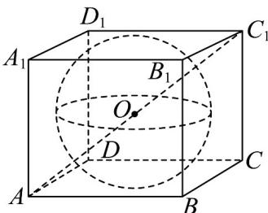

> [!faq]- 《专题8.1 基本立体图形（高效培优讲义）》官方解析
>
> > [!success]- **【答案】** BCD
>
> > [!note]- **【分析】**
> > 根据已知 $O$ 为正方体的中心，且其外接球半径为 $2\sqrt{3}$ ，内切球半径为 2，侧面正方形内切圆半径为 $2\sqrt{2}$ ，结合各项给定的半径及空间想象，正方体和球体的结构特征判断和计算公共点个数、相交弧长·
>
> > [!note]- **【解析】**
> > 由题设，易知 $O$ 为正方体的中心，且其外接球半径为 $2\sqrt{3}$ ，内切球半径为 2，侧面正方形内切圆半
> >
> > 径为 $2\sqrt{2}$ ，
> >
> > 
> >
> > 由 $r = \sqrt{6} \in (2, 2\sqrt{2})$ ，则球 $O$ 的球面与该正方体的面有公共点， ${}^{\mathrm{A}}$ 错；
> >
> > 由 $r = 2\sqrt{2}$ ，则球 $O$ 的球面与该正方体每条棱都相切，共12个切点，B对；
> >
> > 由 $r = 3 \in (2\sqrt{2}, 2\sqrt{3})$ ，则球 $O$ 的球面与该正方体每条棱都都有两个交点，共 $^{24}$ 个， $^{C}$ 对；
> >
> > 由 $r = \frac{2\sqrt{21}}{3} \in (2\sqrt{2}, 2\sqrt{3})$ ，则各面截球 $O$ 所得圆的半径为 $\sqrt{r^2 - 2^2} = \frac{4}{\sqrt{3}} \in (2, 2\sqrt{2})$
> >
> > 所以该圆截各棱所得弦长为 $2\sqrt{\left(\frac{4}{\sqrt{3}}\right)^2 - 2^2} = \frac{4}{\sqrt{3}}$ ，该弦对应圆心角为 $\frac{\pi}{3}$
> >
> > 所以该圆被一个侧面所截的弧长为 $(2\pi - 4 \times \frac{\pi}{3}) \times \frac{4}{\sqrt{3}} = \frac{8\sqrt{3}\pi}{9}$
> >
> > 故所有弧长之和为 $6 \times \frac{8\sqrt{3}\pi}{9} = \frac{16\sqrt{3}\pi}{3}$ ，D 对.
> >
> > 故选 **BCD**
