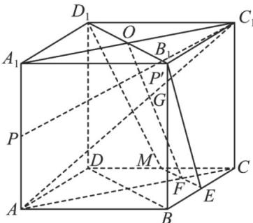
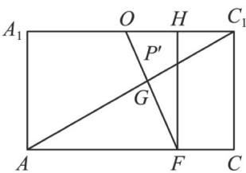

> [!faq]- 《专题8.1 基本立体图形（高效培优讲义）》官方解析
>
> > [!success]- **【答案】** $\frac{3\sqrt{2}}{5}/\frac{3}{5}\sqrt{2}$
>
> > [!note]- **【分析】**
> > 先证明平面 $EB_{1}D_{1}$ 即平面 $EB_{1}D_{1}M$ ，再找出动点 $P^{\prime}$ 的轨迹为线段 $OG$ ，最后计算 $OG$ 的长度即可. 【详解】如图，取 $CD$ 的中点 $M$ ，连接 $EM$ 交 $AC$ 于点 $F$ ，连接 $A_{1}C_{1}$ 、 $B_{1}D_{1}$ 交于点 $O$ ，连接 $OF$ 、 $BD$ ，因为 $E$ 是棱 $BC$ 的中点，所以 $ME \parallel BD$ ，则 $F$ 为 $AC$ 的四等分点且 $AF = \frac{3}{4} AC$ ，
>
> > [!note]- **【解析】**
> > 由正方体的性质可知 $DD_{1}\parallel BB_{1}$ 且 $DD_{1} = BB_{1}$ ，所以四边形 $DD_{1}B_{1}B$ 为平行四边形，所以 $B_{1}D_{1}\parallel BD$
> > 所以 $B_{1}D_{1} / / ME$ ，所以 $B_{1}$ 、 $D_{1}$ 、 $M$ 、 $E$ 四点共面，
> > 所以平面 $B_{1}D_{1}ME \cap$ 平面 $ACC_{1}A_{1} = OF$
> > 连接 $AC_{1}$ 交 OF 于点 G，因为 P 是侧棱 $AA_{1}$ 上的动点，直线 $C_{1}P$ 交平面 $EB_{1}D_{1}$ 于点 $P'$ ，
> > 所以线段 OG 即为点 $P'$ 的轨迹，
> > 
> > 如图在平面 $ACC_{1}A_{1}$ 中，过点 $F$ 作 $HF\perp A_1C_1$ ，交 $A_{1}C_{1}$ 于点 $H$ ，则 $H$ 为 $OC_{1}$ 的中点，
> > 因为 $A_{1}C_{1} // AC$ ，所以 $\triangle AFG \sim \triangle C_{1}OG$ ，所以 $\frac{AF}{OC_{1}} = \frac{GF}{OG} = \frac{\frac{3}{4}AC}{\frac{1}{2}A_{1}C_{1}} = \frac{3}{2}$ ，所以 $OG = \frac{2}{5}OF$ ，
> > 又因为 $HF = 2$ ， $OH = \frac{\sqrt{2}}{2}$ ，所以 $OF = \sqrt{OH^2 + HF^2} = \frac{3\sqrt{2}}{2}$ ，所以 $OG = \frac{2}{5} OF = \frac{2}{5}\times \frac{3\sqrt{2}}{2} = \frac{3\sqrt{2}}{5}$
> > 
> > 故答案为： $\frac{3\sqrt{2}}{5}$
