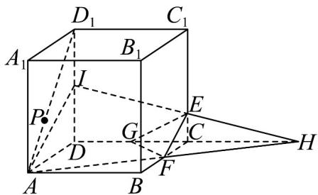
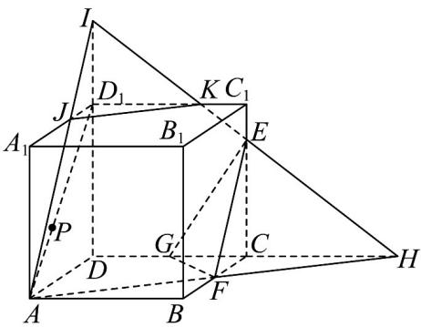
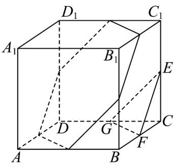
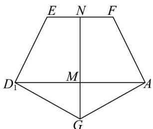

> [!faq]- 《专题8.1 基本立体图形（高效培优讲义）》官方解析
>
> > [!success]- **【答案】** ABD
>
> > [!note]- **【分析】**
> > 先证明所 $AD_{1} // EF$ 可得 A 正确，B，C 作出截面图即可，D 把立体几何展开形成平面的问题即可求解
>
> > [!note]- **【解析】**
> > 对 A，当 $k = \frac{1}{2}$ 时， $CE = \frac{1}{2} CC_{1}$ ，E 为 $CC_{1}$ 中点，
> >
> > ∵ F 是 CB 中点，∴ $EF // BC_{1}$ ，又 $AD_{1} // BC_{1}$ ，所以 $AD_{1} // EF$ ，
> >
> > 即可得 $AD_{1}$ 平面 EFG ，故 A 正确；
> >
> > 对于 $^{B}$ ，如图延长AF交DC与H，连接HE交 $DD_{1}$ 与I，易知当 $0<k\leq\frac{1}{2}$ 时，I在线段 $DD_{1}$ 上，截面如图为梯
> >
> > 形，
> >
> > 
> >
> > 当 $\frac{1}{2} < k < 1$ 时， $I$ 在 $DD_{1}$ 延长线上，截面如图为五边形，
> >
> > 所以当 $\frac{3}{4} < k < 1$ 时，过点 $A, F, E$ 的平面截该正方体所得的截面为五边形，
> >
> > 
> >
> > 故 $^{B}$ 正确；
> >
> > 对于 C，当 $k = \frac{1}{2}$ 时，E 为 $CC_{1}$ 中点，
> >
> > ∵平面 $\alpha//$ 平面 EFG ，∴截面可以为如图正六边形，
> >
> > 
> >
> > 正方体 $ABCD - A_{1}B_{1}C_{1}D_{1}$ 边长为 1，故截面正六边形边长为 $\frac{\sqrt{2}}{2}$
> >
> > 面积 $S = 6 \times \frac{1}{2} \times \frac{\sqrt{2}}{2} \times \frac{\sqrt{2}}{2} \times \sin 60^{\circ} = \frac{3\sqrt{3}}{4} > \frac{\sqrt{3}}{2}$ ，故 C 错误；
> >
> > 对于 D，当 $k = \frac{1}{2}$ 时， $AD_{1} // EF$ ，∴ E、F、A、 $D_{1}$ 四点共面，
> >
> > 如图对平面 $EFAD_{1}$ 和平面 $AD_{1}G$ 沿 $AD_{1}$ 进行展开，
> >
> > 
> >
> > 四边形 $EFAD_{1}$ 为等腰梯形 $AD_{1}=2EF=\sqrt{2}$ ， $ED_{1}=AF=\frac{\sqrt{5}}{2}$ ，∴高 $MN=\frac{3\sqrt{2}}{4}$
> >
> > 又三角形 $AD_{1}G$ 为等腰三角形， $GA = GD_{1} = \frac{\sqrt{5}}{2}$
> >
> > $\therefore GF = \sqrt{\left(\frac{3\sqrt{2}}{4} + \frac{\sqrt{3}}{2}\right)^2 + \left(\frac{\sqrt{2}}{4}\right)^2} = \frac{\sqrt{8 + 3\sqrt{6}}}{2}$ ，又 $PF + PG \leq GF$ ，所以 $PF + PG$ 的最小值为 $\frac{\sqrt{8 + 3\sqrt{6}}}{2}$ ，故D正
> >
> > 确；
> >
> > 故选 **A** B D.
