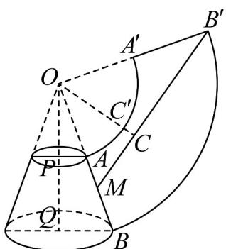

> [!faq]- 《专题8.1 基本立体图形（高效培优讲义）》官方解析
>
> > [!success]- **【答案】** (1)50cm (2)4cm
>
> > [!note]- **【分析】**
> > （1）通过将圆台侧面展开并补成扇形，利用相似三角形求出相关线段长度，再根据弧长公式求出扇
> >
> > 形圆心角，最后在直角三角形中求出绳长最小值；
> >
> > （2）在（1）的展开图基础上，通过三角形面积公式求出点到线段的距离，进而得到圆台上底面圆周上的点
> >
> > 到绳子的最短距离·
>
> > [!note]- **【解析】**
> > （1）沿母线AB将圆台侧面展开并补成扇形，如图所示.
> >
> > 
> >
> > 易知， $\mathrm{Rt}^{\triangle} OPA$ 与 $\mathrm{Rt}\triangle OQB$ 相似，得 $\frac{OA}{OA + AB} = \frac{AP}{BQ} = \frac{1}{2}$
> >
> > 由 AB = 20cm ，解得 OA = 20cm
> >
> > 因为 $\overline{BB'}$ 的长与底面圆 Q 的周长相等，而底面圆 Q 的周长为 $2\pi \times 10 = 20\pi(\text{cm})$ .
> >
> > 又扇形 $OBB'$ 的半径 OB = OA + AB = 20 + 20 = 40(cm)
> >
> > 设扇形 $OBB'$ 的圆心角为 $\alpha$ ， $40\alpha = 20\pi$ ，解得 $\alpha = \frac{\pi}{2}$ ，则 $OB \perp OB'$ ：
> >
> > 在 Rt△B'OM 中， $B'M^{2}=40^{2}+30^{2}$ ，所以 $B'M=50cm$ ，
> >
> > 即所求绳长的最小值为 50cm
> >
> > (2) 如图所示，过点 $O$ 作 $OC \perp B'M$ ，垂足为 $C$ ，交 $\overline{AA'}$ 于点 $C'$ ，则所求最短距离即为 $CC'$ 的长。
> >
> > 因为 $OC = \frac{OM \times OB'}{B'M} = \frac{30 \times 40}{50} = 24(\text{cm})$ ，所以 $C'C = OC - OC' = 24 - 20 = 4(\text{cm})$ ，
> >
> > 即绳长最短时，圆台上底面圆周上的点到绳子的最短距离为 $4 \, cm$ .
