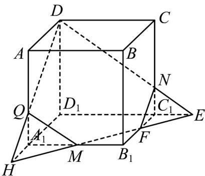
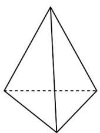
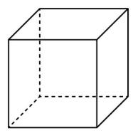
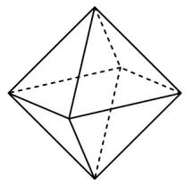
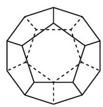
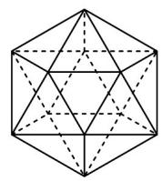

> [!faq]- 《专题8.1 基本立体图形（高效培优讲义）》官方解析
>
> > [!success]- **【答案】** (1)答案见解析 (2) $6\sqrt{13}+3\sqrt{2}$
>
> > [!note]- **【分析】**
> > （1）如图所示，五边形DQMFN即为所求截面，得到答案·
> >
> > (2) 根据相似得到各线段长度，再计算周长得到答案.
>
> > [!note]- **【解析】**
> > （1）如图所示，五边形DQMFN即为所求截面.
> >
> > 
> >
> > 作法如下：连接 DN 并延长交 $D_{1}C_{1}$ 的延长线于点 E，连接 ME 交 $B_{1}C_{1}$ 于点 F，
> >
> > 交 $D_{1}A_{1}$ 的延长线于点 H，连接 DH 交 $AA_{1}$ 于点 Q，连接 QM，FN，
> >
> > 所以五边形 $DQMFN$ 即为所求截面·
> >
> > (2) 因为 $\triangle NEC_{1} \sim \triangle DED_{1}$ ，所以 $\frac{EC_{1}}{ED_{1}} = \frac{NC_{1}}{DD_{1}} = \frac{1}{3}$ ，得 $EC_{1} = 3$ .
> >
> > 因为 $\triangle A_{1}HM\sim \triangle D_{1}HE$ ，所以 $\frac{HA_1}{HD_1} = \frac{A_1M}{D_1E} = \frac{3}{9} = \frac{1}{3}$ ，得 $A_{1}H = A_{1}M = 3$
> >
> > 则 $C_{1}F = 3$ ， $A_{1}Q = 2$ ，所以 $DQ = DN = \sqrt{36 + 16} = 2\sqrt{13}$
> >
> > $QM = NF = \sqrt{4 + 9} = \sqrt{13}$ $MF = \sqrt{9 + 9} = 3\sqrt{2}$
> >
> > 则截面 $DQMFN$ 的周长为 $4\sqrt{13} + 2\sqrt{13} + 3\sqrt{2} = 6\sqrt{13} + 3\sqrt{2}$ .
> >
> > 13. 多面体的欧拉定理：简单多面体的顶点数 $V$ 、棱数 $E$ 与面数 $F$ 满足 $V + F - E = 2$ 的数学关系·请运用欧拉
> >
> > 定理解决以下问题：
> >
> > 
> > 正四面体
> >
> > 
> > 正六面体 (正方体)
> >
> > 
> > 正八面体
> >
> > 
> > 正十二面体
> >
> > 
> > 正二十面体
> >
> > (1)碳 $60\left(\mathrm{C}_{60}\right)$ 的分子结构是一个由正五边形面和正六边形面共32个面构成的凸多面体，60个碳原子处于多面
> >
> > 体的 $^{60}$ 个顶点位置，求 $^{32}$ 个面中正六边形面的个数；
> >
> > (2)规定：多面体在顶点处的曲率等于 $2\pi$ 与多面体在该点的所有面角之和的差（多面体的面角是指多面体的面
> >
> > 上的多边形的内角的大小，用弧度制表示），多面体的总曲率等于该多面体各顶点的曲率之和·例如：正方体
> >
> > 在每个顶点有 $^{3}$ 个面角，每个面角是 $\frac{\pi}{2}$ ，所以正方体在各顶点的曲率为 $2\pi-3\times\frac{\pi}{2}=\frac{\pi}{2}$ ，故其总曲率为 $8\times\frac{\pi}{2}=4\pi$ 。
> >
> > 证明：任何简单多面体的总曲率是常数；
> >
> > (3)如果一个正多面体的所有面都是全等的正三角形或正多边形，每个顶点聚集的棱的条数都相等，这个多面
> >
> > 体叫做正多面体·设某个正多面体每个顶点聚集的棱的条数为 $m$ ，每个面的边数为 $n$ ，求 $m,n,E$ 满足的关系式；
> >
> > 并据此说明正多面体仅有以下五种：正四面体、正方体、正八面体、正十二面体和正二十面体·
> >
> > 【答案】(1)20 (2)证明见解析 (3)答案见解析
> >
> > 【分析】（1）由已知，正五边形的个数为 $x$ ，正六边形的个数为 $y$ ，则 $\left\{ \begin{array}{l} \frac{1}{2}(5x + 6y) = 90 \\ x + y = 32 \end{array} \right.$ ，解出 $y$ 即可；
> >
> > (2) 设多面体有 F 个面，给组成多面体的多边形编号，分别为 $1,2,\cdots,F$ 号，得到多面体的顶点数，进而得
> >
> > 所有多边形内角之和，算出总曲率为常数，即可证明；
> >
> > （3）由题意得 $2E = nF = mV$ ，代入 $V + F - E = 2$ ，可得 $\frac{1}{m} +\frac{1}{n} = \frac{1}{2} +\frac{1}{E}$ ，因此 $\frac{1}{m} +\frac{1}{n} >\frac{1}{2}$ ，又 $m\quad 3,n\quad 3$ ，列
> >
> > 出分别说明，即得答案·
> >
> > 【详解】（1）由题意可知 $V = 60$ ， $F = 32$ ，由 $V + F - E = 2$ 可得 $E = 90$
> >
> > 设正五边形的个数为 $x$ ，正六边形的个数为 $y$ ，则 $x + y = 32$
> >
> > 因为一条棱连着两个面，所以足球烯表面的棱数 $E = \frac{1}{2}(5x + 6y) = 90$ ，
> >
> > 联立 $\left\{\begin{aligned}\frac{1}{2}(5x+6y)=90\\ x+y=32\end{aligned}\right.$ ，解得 $\left\{\begin{aligned}x=12\\ y=20\end{aligned}\right.$ ，即 32 个面中正六边形面的个数是 20.
> >
> > (2) 设多面体有 F 个面，给组成多面体的多边形编号，分别为 $1,2,\cdots,F$ 号，
> >
> > 设第 i 号 $(1 \leq i \leq F)$ 多边形有 $E_{i}$ 条边，多面体有 $E = \frac{E_{1} + E_{2} + \cdots + E_{F}}{2}$ 条棱，
> >
> > 由题意，多面体共有 $V = 2 - F + E = 2 - F + \frac{E_{1} + E_{2} + \cdots + E_{F}}{2}$ 个顶点，
> >
> > $i$ 号多边形内角之和 $\left(E_{i} - 2\right)\pi$ ，所有多边形内角之和 $\pi (E_1 + E_2 + \dots +E_F) - 2\pi F$
> >
> > 故总曲率 $2\pi V - \left[\pi\left(E_{1} + E_{2} + \cdots + E_{F}\right) - 2\pi F\right] = 2\pi\left(2 - F + \frac{E_{1} + E_{2} + \cdots + E_{F}}{2}\right) - \left[\pi\left(E_{1} + E_{2} + \cdots + E_{F}\right) - 2\pi F\right] = 4\pi$
> >
> > 则任何简单多面体的总曲率是常数；
> >
> > (3) 由某个正多面体每个顶点聚集的棱的条数为 $m$ ，每个面的边数为 $n$ ，可知 $2E = nF = mV$
> >
> > 于是 $V = \frac{2E}{m}, F = \frac{2E}{n}$ ，将其代入 $V + F - E = 2$ ，
> >
> > 所以 $\frac{2E}{m} +\frac{2E}{n} -E = 2$ ，所以 $\frac{1}{m} +\frac{1}{n} = \frac{1}{2} +\frac{1}{E}$
> >
> > 因此 $\frac{1}{m} +\frac{1}{n} >\frac{1}{2}$ ，又 $m$ 3,n 3，
> >
> > 故所有五组正整数解为： $\left\{ \begin{array}{l}m = 3\\ n = 3 \end{array} \right.,\left\{ \begin{array}{l}m = 3\\ n = 4 \end{array} \right.,\left\{ \begin{array}{l}m = 3\\ n = 5 \end{array} \right.,\left\{ \begin{array}{l}m = 4\\ n = 3 \end{array} \right.,\left\{ \begin{array}{l}m = 5\\ n = 3 \end{array} \right.,$
> >
> > 当 $\left\{\begin{aligned}m=3\\ n=3\end{aligned}\right.$ 时，E=6，则 $F=\frac{2E}{n}=4$ ，此时正多面体为正四面体，
> >
> > 当 $\left\{\begin{aligned}m=3\\ n=4\end{aligned}\right.$ 时，E=12，则 $F=\frac{2E}{n}=6$ ，此时正多面体为正六面体，
> >
> > 当 $\left\{ \begin{array}{l} m = 3 \\ n = 5 \end{array} \right.$ 时， $E = 30$ ，则 $F = \frac{2E}{n} = 12$ ，此时正多面体为正十二面体，
> >
> > 当 $\left\{ \begin{array}{l} m = 4 \\ n = 3 \end{array} \right.$ 时， $E = 12$ ，则 $F = \frac{2E}{n} = 8$ ，此时正多面体为正八面体，
> >
> > 当 $\left\{\begin{aligned}m=3\\ n=3\end{aligned}\right.$ 时，E=30，则 $F=\frac{2E}{n}=20$ ，此时正多面体为正二十面体，
> >
> > 所以正多面体仅有正四面体、正方体、正八面体、正十二面体和正二十面体共五种·
