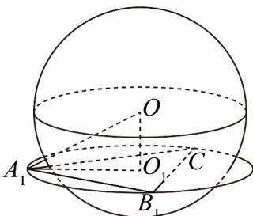

> [!faq]- 《专题8.1 基本立体图形（高效培优讲义）》官方解析
>
> > [!success]- **【答案】** (1) $\sqrt{29}$ (2)① $\frac{4\sqrt{6}}{3}$ ; ② $2\sqrt{2}$ ; ③ $\frac{4\sqrt{6}}{3}$
>
> > [!note]- **【分析】**
> > （1）由题意，长方体的区径为长方体体对角线，计算即可求出；
> >
> > (2) ① $\triangle ACB_{1}$ 外接圆的区径为外接圆直径，又 $\triangle ACB_{1}$ 的边长为 $2\sqrt{2}$ 的正三角形，即可求得其区径；②正方
> >
> > 体的棱切球的区径为正方体的面对角线的长，计算可得；③记棱切球的球心为 O，即为正方体的中心，记
> >
> > $\triangle ACB_{1}$ 的外接圆圆心为 $O_{1}$ ，设点 $M$ 在球 $O$ 上，点 $N$ 在 $\odot O_{1}$ 上，若两点同时在球上或圆上，则最大距离为
> >
> > $\odot O_{1}$ 的直径，求出即可·
>
> > [!note]- **【解析】**
> > （1）长方体的区径为长方体体对角线，
> >
> > 则长宽高为 $^{2}$ 、 $^{3}$ 、 $^{4}$ 的长方体的区径为 $\sqrt{4+9+16}=\sqrt{29}$ .
> >
> > (2) 正方体 $ABCD - A_{1}B_{1}C_{1}D_{1}$ 的棱长为 2，
> > - **①**：因为 $\triangle ACB_{1}$ 的边长为 $\sqrt{2^{2}+2^{2}}=2\sqrt{2}$ 的正三角形，
> >
> > $\triangle ACB_{1}$ 外接圆的区径为外接圆直径，
> >
> > 所以 $\triangle ACB_{1}$ 外接圆的区径为 $2 \times \frac{\sqrt{3}}{3} \times 2\sqrt{2} = \frac{4\sqrt{6}}{3}$ ;
> > - **②**：正方体的棱切球（与各棱相切的球）的区径为球直径，
> >
> > 该球的直径即为正方体的面对角线的长，即为 $\sqrt{2^{2}+2^{2}}=2\sqrt{2}$
> > - **③**：记棱切球的球心为 O，即为正方体的中心，易求得棱切球的半径为 $\frac{\sqrt{2^{2}+2^{2}}}{2}=\sqrt{2}$
> >
> > 记 $\triangle ACB_{1}$ 的外接圆圆心为 $O_{1}$ ，因为 $\triangle ACB_{1}$ 为正三角形，
> >
> > 由①可得 $\triangle ACB_{1}$ 外接圆的半径为 $O_{1}A = \frac{2\sqrt{6}}{3}$ ，正方体的体对角线的一半为 $OA = \sqrt{3}$
> >
> > 则在 $\mathrm{Rt}\triangle A O O_{1}$ 中， $|O O_{1}| = \sqrt{\left(\sqrt{3}\right)^{2} - \left(\frac{2\sqrt{6}}{3}\right)^{2}} = \frac{\sqrt{3}}{3}$ ，
> >
> > 则球心 $O$ 到 $\triangle ACB_{1}$ 的外接圆上任意一点的距离均为 $\sqrt{3}$ ，圆 $O_{1}$ 与球 $O$ 的位置关系如图：
> >
> > 
> >
> > 若两点分别在球上和圆上，设点 $M$ 在球 $O$ 上，点 $N$ 在 $\odot O_{1}$ 上，
> >
> > 则有 $\left|OM\right|=\sqrt{2}$ ， $\left|ON\right|=\sqrt{3}$
> >
> > 所以 $\left|MN\right|\leq\left|OM\right|+\left|ON\right|=\sqrt{2}+\sqrt{3}$ ，当 M，O，N 三点共线，且 M，N 在 O 的异侧时取到等号.
> >
> > 若两点同时在球上或圆上，则最大距离为 $\odot O_{1}$ 的直径，即 $\frac{4\sqrt{6}}{3}$
> >
> > $$
> > 4 \sqrt {6}
> > $$
> >
> > 综上，该几何系统的区径为 3 ·
