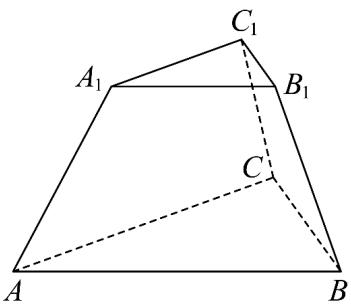

<!-- question-source:start -->
【变式2】如图， $ABC-A_{1}B_{1}C_{1}$ 是一个正三棱台，而且下底面边长为 $^{4}$ ，上底面边长和侧棱长都为 $^{2}$ ，则棱台

的高为（）

A. $\frac{4\sqrt{6}}{3}$ B. $\frac{3\sqrt{6}}{2}$ C. $\sqrt{6}$ D. $\frac{2\sqrt{6}}{3}$
<!-- question-source:end -->

![[高中/课堂同步/题库/人教A版高中数学同步讲义(2026)/02_必修第二册/第八章 立体几何初步/专题8.1 基本立体图形（高效培优讲义）/题型01_简单几何体的结构特征/questions/answers/Q00078178A1.md]]
