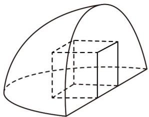
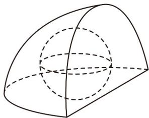

<!-- question-source:start -->
【变式3】若一个棱长为 $2$ 的正方体内接于四分之一球形封闭几何体（正方体的两个面分别在两个半圆面上，

另外两个顶点在曲面上），则四分之一球形封闭几何体的内切球的半径为\_\_\_\_。

<!-- question-source:end -->

![[高中/课堂同步/题库/人教A版高中数学同步讲义(2026)/02_必修第二册/第八章 立体几何初步/专题8.1 基本立体图形（高效培优讲义）/题型01_简单几何体的结构特征/questions/answers/Q00078179A1.md]]
