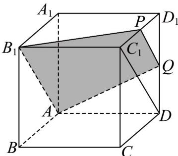

> [!faq]- 《专题8.1 基本立体图形（高效培优讲义）》官方解析
>
> > [!success]- **【答案】** B
>
> > [!note]- **【分析】**
> > 取 $C_{1}D_{1}$ 中点P，可证 $AB_{1}//C_{1}D//PQ$ ，且 $PQ=\frac{1}{2}C_{1}D=\frac{1}{2}AB_{1}$ ，可得过 $Q,A,B_{1}$ 的截面的形状.
>
> > [!note]- **【解析】**
> > 
> >
> > 如图所示：取 $C_1D_1$ 的中点 $P$ ，连接 $PQ, PB_1, AB_1, AQ$ 和 $DC_1$
> >
> > 因为 P, Q 分别是 $C_{1}D_{1}, DD_{1}$ 的中点，所以 $PQ // C_{1}D$ 且 $PQ = \frac{1}{2}C_{1}D$
> >
> > 又 $AB_{1} / / C_{1}D$ ，故 $PQ / / AB_{1}$ 且 $PQ = \frac{1}{2} AB_{1}$
> >
> > 故 $A, B_{1}, P, Q$ 四点共面，且四边形 $AB_{1}PQ$ 是过 $Q, A, B_{1}$ 三点的截面，
> >
> > 又因为四边形 $AB_{1}PQ$ 是梯形，故选 B.
> >
> > 故选：B
> >
> > ## 方法技巧
> >
> > 在解答关于空间几何体概念的判断题时，要注意紧扣定义判断，这就要求熟悉各种空间几何体的概念的内涵
> >
> > 和外延，切忌只凭图形主观臆断。
