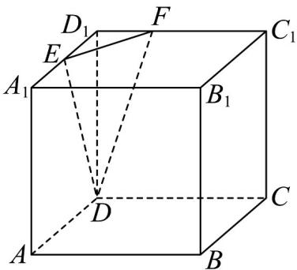
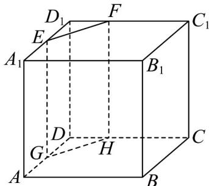
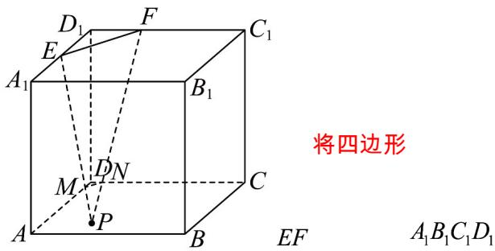

> [!faq]- 《专题8.1 基本立体图形（高效培优讲义）》官方解析
>
> > [!success]- **【答案】** ACD
>
> > [!note]- **【分析】**
> > 根据正方体的结构特征，结合平面图形的性质分别分析截面形状即可求出结果·
>
> > [!note]- **【解析】**
> > 如图，连接 $DE$ ， $DF$ ，则平面 $DEF$ 可截得三棱锥 $D - D_{1}EF$
> >
> > 
> >
> > 如图，过 $E$ 作 $EG \perp AD$ ，过 $F$ 作 $FH \perp CD$
> >
> > 则过 E，F 的平面 EFHG 可截得直三棱柱 $D_{1}EF-DGH$ 和直五棱柱 $ABCHG-A_{1}B_{1}C_{1}FE$
> >
> > 
> >
> > 如图，延长 $D_{1}D$ 至 $P$ ，连接 $PE$ ， $PF$ 分别与交于两点 $M$ ， $N$ ，则可得平面截得三棱台 $DMN - D_{1}EF$
> >
> > 
> >
> > 分成一个三角形和一个五边形，所以不可能得到四棱柱·
> >
> > 故选 **ACD**
