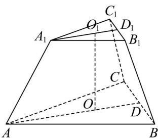

> [!faq]- 《专题8.1 基本立体图形（高效培优讲义）》官方解析
>
> > [!success]- **【答案】** D
>
> > [!note]- **【分析】**
> > 结合图形，取正三棱台 $ABC-A_{1}B_{1}C_{1}$ 的上下底面中心为 $O_{1},O$ ，连接 $A_{1}O_{1}$ 并延长交 $B_{1}C_{1}$ 于点 $D_{1}$ ，连接 AO 并延长交 BC 于点 D，分别计算 $A_{1}O_{1},OA$ 的长，利用直角梯形 $A_{1}O_{1}OA$ 即可求得答案·
>
> > [!note]- **【解析】**
> > 
> >
> > 如图，取正三棱台 $ABC - A_{1}B_{1}C_{1}$ 的上下底面中心为 $O_{1}, O$ ，则 $OO_{1}$ 即为棱台的高·
> >
> > 连接 $A_{1}O_{1}$ 并延长交 $B_{1}C_{1}$ 于点 $D_{1}$ ，连接 AO 并延长交 BC 于点 D·
> >
> > 依题意， $AD=\frac{\sqrt{3}}{2}\times4=2\sqrt{3},AO=\frac{2}{3}AD=\frac{4\sqrt{3}}{3},A_{1}D_{1}=\frac{\sqrt{3}}{2}\times2=\sqrt{3},A_{1}O_{1}=\frac{2}{3}A_{1}D_{1}=\frac{2\sqrt{3}}{3}$
> >
> > 在直角梯形 $A_{1}O_{1}OA$ 中， $O_{1}O = \sqrt{2^{2} - (\frac{4\sqrt{3}}{3} - \frac{2\sqrt{3}}{3})^{2}} = \frac{2\sqrt{6}}{3}$ ，即棱台的高为 $\frac{2\sqrt{6}}{3}$
> >
> > 故选 **D**.
