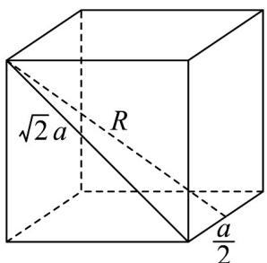
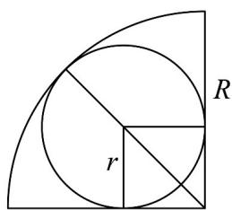

> [!faq]- 《专题8.1 基本立体图形（高效培优讲义）》官方解析
>
> > [!success]- **【答案】** $3(\sqrt{2} - 1)$
>
> > [!note]- **【分析】**
> > 画出图象，结合图象利用勾股定理即可求解·
>
> > [!note]- **【解析】**
> > 设球形封闭几何体的半径为 R ，如图，
> >
> > 
> >
> > 
> >
> > 正方体的棱长 $a$ 满足 $(\sqrt{2} a)^2 + \left(\frac{a}{2}\right)^2 = R^2$ ，因为 $a = 2$ ，所以 $R = 3$ ，
> >
> > 内切球半径 r 满足 $(\sqrt{2} + 1)r = R$ ，所以 $r = \frac{3}{\sqrt{2} + 1} = 3(\sqrt{2} - 1)$ .
> >
> > 故答案为： $3(\sqrt{2}-1)$ .
