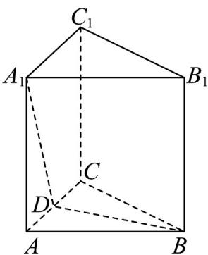

<!-- question-source:start -->
【典例1】如图，在直三棱柱 $ABC-A_{1}B_{1}C_{1}$ 中， $\angle ACB=\frac{\pi}{2}$ ，AC=4，BC=2， $AA_{1}=4$ ，点D在棱AC上，

求 $A_{1}D + DB$ 的最小值（）

A. $4 + 2\sqrt{5}$ B. $4\sqrt{2} + 2$ C. $2\sqrt{5} + 2\sqrt{2}$ D. $2\sqrt{13}$
<!-- question-source:end -->

![[高中/课堂同步/题库/人教A版高中数学同步讲义(2026)/02_必修第二册/第八章 立体几何初步/专题8.1 基本立体图形（高效培优讲义）/题型02_几何体中的基本计算/questions/answers/Q00078180A1.md]]
