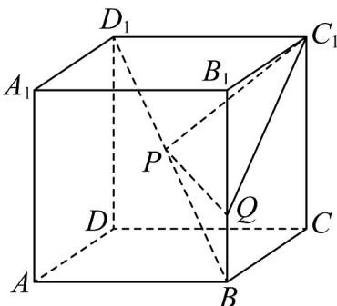

<!-- question-source:start -->
【变式3】如图，在棱长为 $^{1}$ 的正方体 $ABCD-A_{1}B_{1}C_{1}D_{1}$ 中，P,Q 分别为棱 $BD_{1}$ 和 $BB_{1}$ 上的动点，求 $\triangle C_{1}PQ$ 周

长的最小值.

<!-- question-source:end -->

![[高中/课堂同步/题库/人教A版高中数学同步讲义(2026)/02_必修第二册/第八章 立体几何初步/专题8.1 基本立体图形（高效培优讲义）/题型02_几何体中的基本计算/questions/answers/Q00078183A1.md]]
