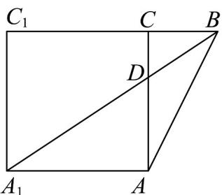
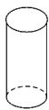
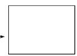
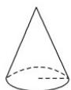
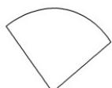
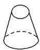
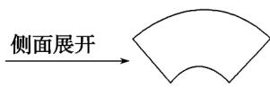

> [!faq]- 《专题8.1 基本立体图形（高效培优讲义）》官方解析
>
> > [!success]- **【答案】** D
>
> > [!note]- **【分析】**
> > 将平面 ABC 、平面 $AA_{1}C_{1}C$ 延展为同一个平面，分析可知当 $A_{1}$ 、 B 、 D 三点共线时， $A_{1}D+DB$ 取最
> >
> > 小值，结合勾股定理可求得结果·
>
> > [!note]- **【解析】**
> > 将平面 ABC 、平面 $AA_{1}C_{1}C$ 延展为同一个平面，如下图所示：
> >
> > 
> >
> > 由图可知，当 $A_{1}$ 、B、D 三点共线时， $A_{1}D+DB$ 取最小值，
> >
> > 且 $A_{1}C_{1} = CC_{1} = 4$ ， $BC = 2$ ，且 $\angle ACB = \angle ACC_{1} = 90^{\circ}$
> >
> > 延展后，B、C、 $C_{1}$ 共线，且 $BC_{1}=2+4=6$ ， $A_{1}C_{1}=4$ ， $\angle A_{1}C_{1}B=90^{\circ}$
> >
> > 由勾股定理可得 $A_{1}B=\sqrt{A_{1}C_{1}^{2}+BC_{1}^{2}}=\sqrt{4^{2}+6^{2}}=2\sqrt{13}$
> >
> > 故 $A_{1}D + DB$ 的最小值为 $2\sqrt{13}$ .
> >
> > ## 方法技巧
> >
> > 解此类题的关键要清楚几何体的侧面展开图是什么样的平面图形，并进行合理的空间想象，且记住以下常见几何体的侧面展开图：
> >
> > 
> > 圆柱
> >
> > 侧面展开
> >
> > 
> > 矩形
> >
> > 
> > 圆锥
> >
> > 
> > 扇形
> >
> > 
> > 圆台
> >
> > 
> > 扇环
