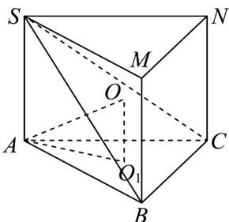

> [!faq]- 《专题8.1 基本立体图形（高效培优讲义）》官方解析
>
> > [!success]- **【答案】** A
>
> > [!note]- **【分析】**
> > 将三棱锥 S-ABC 转化为正三棱柱 SMN-ABC，根据题意结合正三棱柱的性质求外接球的半径·
>
> > [!note]- **【解析】**
> > 将三棱锥 S-ABC 转化为正三棱柱 SMN-ABC
> >
> > 可知三棱锥 $S - ABC$ 的外接球即为正三棱柱 $SMN - ABC$ 的外接球，
> >
> > 
> >
> > 设VABC的外接圆圆心为 $O_{1}$ ，半径为r，
> >
> > 则 $2r=\frac{AB}{\sin\angle ACB}=\frac{3}{\frac{\sqrt{3}}{2}}=2\sqrt{3}$ ，可得 $r=\sqrt{3}$ ，
> >
> > 设三棱锥 S-ABC 的外接球球心为 O，连接 OA， $OO_{1}$
> >
> > 则 $OO_{1}=1$ ，因为 $OA^{2}=O_{1}O^{2}+O_{1}A^{2}$ ，解得 OA=2，
> >
> > 所以该三棱锥外接球的半径长为 2.
> >
> > 故选 **A**.
