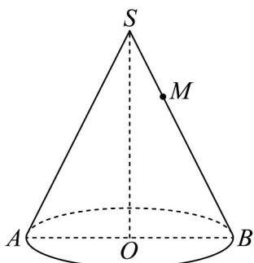
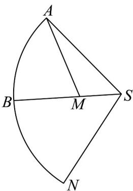

> [!faq]- 《专题8.1 基本立体图形（高效培优讲义）》官方解析
>
> > [!success]- **【答案】**  A. $\sqrt{7}$ B. $\sqrt{13}$ C. $\sqrt{19}$ D. $3\sqrt{3}$
>
> > [!note]- **【分析】**
> > 先根据体积公式得出 $OS = 2\sqrt{2}$ ，将圆锥沿母线展开，结合圆心角的大小，利用余弦定理求解即可。
>
> > [!note]- **【解析】**
> > 设圆锥 SO 的母线长为 l，底面的半径为 r，圆锥 SO 的体积为 $\frac{1}{3}\pi \times 1^{2} \times SO = \frac{2\sqrt{2}}{3}\pi$ ，解得 $OS = 2\sqrt{2}$ 由勾股定理，可得母线 $l = \sqrt{1^{2} + (2\sqrt{2})^{2}} = 3$
> >
> > 如图，圆锥的侧面展开图为扇形 SAN，
> >
> > 因为扇形 $SAN$ 的弧长为 $2\pi r = 2\pi$ ，所以扇形 $SAN$ 的圆心角 $\alpha = \frac{2\pi}{3}$ ，所以 $\angle ASM = \frac{\pi}{3}$
> >
> > 
> >
> > 在 $\triangle SAM$ 中，由余弦定理是可得 $AM^2 = SA^2 + SM^2 - 2SA\square SM\cos \angle ASM = 9 + 1 - 3 = 7$
> >
> > 所以 $AM = \sqrt{7}$ ，因为 $SA + SM = 4 > \sqrt{7}$
> >
> > 所以蚂蚁爬行的最短距离为 $AM$ 的长度，即蚂蚁爬行的最短距离为 $\sqrt{7}$
> >
> > 故选 **A**.
