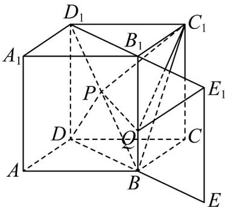

> [!faq]- 《专题8.1 基本立体图形（高效培优讲义）》官方解析
>
> > [!success]- **【答案】** $\sqrt{4 + 2\sqrt{2}}$
>
> > [!note]- **【分析】**
> > 求解某些几何体表面的线段长度最值问题，需要把相关线段转化到同一个平面上，变成同一平面上
> >
> > 的线段最值问题，即把立体几何问题转化为平面几何问题。
>
> > [!note]- **【解析】**
> > 如图，连结 $BD$ ， $BC_{1}$ ，由 $\triangle D_{1}C_{1}P\cong \triangle D_{1}DP$ 可得 $C_1P = DP$
> >
> > 
> >
> > 将平面 $BCC_{1}B_{1}$ 绕轴 $BB_{1}$ 旋转到与对角平面 $BDD_{1}B_{1}$ 在同一平面上的 $BEE_{1}B_{1}$ ，得 $C_1Q = E_1Q$
> >
> > 因为 $BD = \sqrt{1^2 + 1^2} = \sqrt{2}, BE = BB_1 = EE_1 = 1, DE = DB + BE = \sqrt{2} + 1$
> >
> > 所以 $\Delta C_{1}PQ$ 的周长 $= C_{1}P + PQ + QC_{1} = DP + PQ + QE_{1}$ $DE_{1} = \sqrt{DE^{2} + EE_{1}^{2}} = \sqrt{4 + 2\sqrt{2}}$
> >
> > 所以 $\Delta C_{1}PQ$ 周长的最小值为 $\sqrt{4 + 2\sqrt{2}}$
