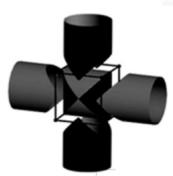
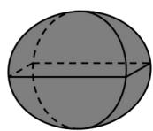
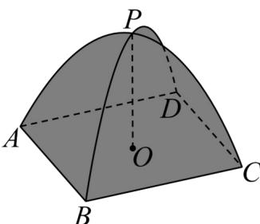

<!-- question-source:start -->
【变式2】“牟和方盖”是我国古代数学家刘徽在研究球的体积的过程中构造的一个和谐优美的几何体，它是由两个相同的圆柱分别从纵横两个方向嵌入一个正方体时两圆柱公共部分形成的几何体（如图1）.如图2所示的“四脚帐篷”类似于“牟和方盖”的一部分，其中APC与BPD为相互垂直且全等的半圆面，它们的圆心为O，半径为1.用平行于底面ABCD的平面α去截“四脚帐篷”当平面α经过OP的中点时，截面图形的面积为\_。

图 1
图 2
<!-- question-source:end -->

![[高中/课堂同步/题库/人教A版高中数学同步讲义(2026)/02_必修第二册/第八章 立体几何初步/专题8.1 基本立体图形（高效培优讲义）/题型03_简单几何体的组合体/questions/answers/Q00078186A1.md]]
