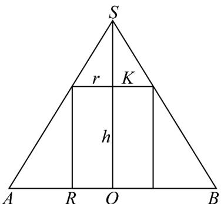

> [!faq]- 《专题8.1 基本立体图形（高效培优讲义）》官方解析
>
> > [!success]- **【答案】** (1)13 (2) $h = 6$ ; 最大值为 30
>
> > [!note]- **【解析】**
> > （1）∵圆锥 SO 的底面半径 R = 5，高 H = 12，
> >
> > ∴圆锥 SO 的母线长 $L = \sqrt{H^{2} + R^{2}} = 13$ ；
> >
> > (2) 作出圆锥、圆柱的轴截面如图所示，
> >
> > 
> >
> > 其中 $SO = 12$ ， $OA = OB = 5$ ， $OK = h(0 < h < 12)$
> >
> > 设圆柱底面半径为 $r$ ，则 $\frac{r}{5} = \frac{12 - h}{12}$ ，即 $r = \frac{5(12 - h)}{12}$
> >
> > 设圆柱的轴截面面积为 $S' = 2r \cdot h = \frac{5}{6} (12h - h^2) = \frac{5}{6} \left[-(h - 6)^2 + 36\right] (0 < h < 12)$
> >
> > ∴当 h=6 时， $S'$ 有最大值为 30。
