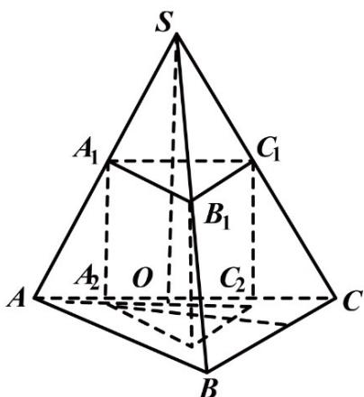

> [!faq]- 《专题8.1 基本立体图形（高效培优讲义）》官方解析
>
> > [!success]- **【答案】** $(1)^{10}$ 或 $5(2)\frac{1}{9}$ 或 $\frac{4}{9}$
>
> > [!note]- **【分析】**
> > （1）设正三棱柱的高为 $h$ ，底面边长为 $x$ ，根据相似比有 $\frac{15 - h}{15} = \frac{x}{12}$ ，再根据正三棱柱的侧面
> >
> > 积为 120，有 3xh = 120，两式联立求解·
> >
> > (2) 根据面积之比等于相似比的平方，结合 (1) 的结论求解
>
> > [!note]- **【解析】**
> > （1）设正三棱柱的高为 h，底面边长为 x，如图所示：
> >
> > 
> >
> > 则 $\frac{15 - h}{15} = \frac{x}{12}$
> >
> > 解得 $x = \frac{4}{5}(15 - h)$
> >
> > 又因为正三棱柱的侧面积为 120.
> >
> > 所以 3xh = 120
> >
> > 所以 $xh = 40$
> >
> > 解得 $x = 4, h = 10$ 或 $x = 8, h = 5$
> >
> > 所以三棱柱的高是 $^{10}$ 或 $^{5}$ .
> >
> > (2) 因为面积之比等于相似比的平方，
> >
> > 所以棱柱的上底面截棱锥所得的小棱锥与原棱锥的侧面积之比： $\frac{S_{S - A_1B_1C_1}}{S_{S - ABC}} = \left(\frac{15 - h}{15}\right)^2 = \frac{1}{9}$ 或 $\frac{S_{S - A_1B_1C_1}}{S_{S - ABC}} = \left(\frac{15 - h}{15}\right)^2 = \frac{4}{9}.$
