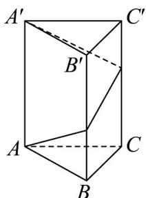
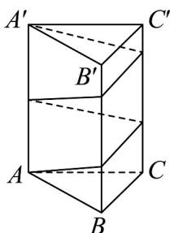

<!-- question-source:start -->
【变式3】已知正三棱柱 $ABC-A'B'C'$ ，底面边长为1，高为8

(1)一点自 $A$ 点出发沿着三棱柱的侧面绕行一周后到达 $A^{\prime}$ 点的最短路线长；

(2)一点自 $A$ 点出发沿着三棱柱的侧面绕行两周后到达 $A'$ 点的最短路线长.
<!-- question-source:end -->

![[高中/课堂同步/题库/人教A版高中数学同步讲义(2026)/02_必修第二册/第八章 立体几何初步/专题8.1 基本立体图形（高效培优讲义）/题型04_简单几何体的表面展开与折叠问题/questions/answers/Q00078191A1.md]]
