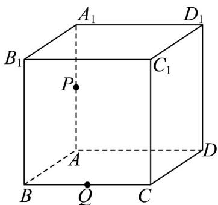
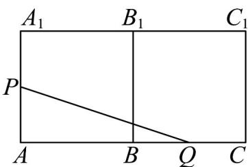
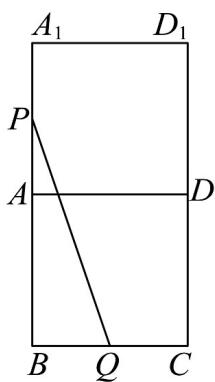
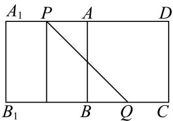

> [!faq]- 《专题8.1 基本立体图形（高效培优讲义）》官方解析
>
> > [!success]- **【答案】** D
>
> > [!note]- **【分析】**
> > 将正方体沿着不同的方向展开，得到展开图，化曲（折）为直，再利用勾股定理计算可得
>
> > [!note]- **【解析】**
> > 如图，在正方体 $ABCD-A_{1}B_{1}C_{1}D_{1}$ 中，P、Q 分别为棱 $AA_{1}$ ，BC 的中点，
> >
> > 
> >
> > 按照下列方式展开， $PQ=\sqrt{1^{2}+(2+1)^{2}}=\sqrt{10}$
> >
> > 
> >
> > 按照下列方式展开， $PQ=\sqrt{1^{2}+(2+1)^{2}}=\sqrt{10}$
> >
> > 
> >
> > 按照下列方式展开， $PQ = \sqrt{2^2 + 2^2} = 2\sqrt{2}$
> >
> > 
> >
> > 综上所述，最短路径 $PQ = 2\sqrt{2}$
> >
> > 故选：D.
> >
> > ## 方法技巧
> >
> > (1) 立体几何中的翻折（展开）问题截图的关键是：翻折（展开）过程中的不变量；
> >
> > (2) 立体几何中距离的最值一般处理方式：
> > - **①**：几何法：通过位置关系，找到取最值的位置（条件），直接求最值；
> > - **②**：代数法：建立适当的坐标系，利用代数法求最值。
