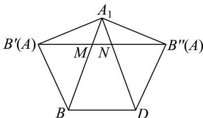

> [!faq]- 《专题8.1 基本立体图形（高效培优讲义）》官方解析
>
> > [!success]- **【答案】** D
>
> > [!note]- **【分析】**
> > 根据题意，求得 $AA_{1}=2$ ，将平面 $A_{1}BD$ ， $A_{1}AD$ ， $A_{1}AB$ 展开到同一平面，连接 $B'B''$ ，的得到
> >
> > $AE + EF + AF \quad B'M + MN + NB'' = B'B''$ ，在 $^{\triangle}A_{1}B'B''$ 中，利用余弦定理，求得 $B'B''$ 的长，即可得到答案.
>
> > [!note]- **【解析】**
> > 由题意，可得 $AE + EF + AF \quad \lambda$ ，因为 $4\pi \cdot \left( \frac{\sqrt{2}}{2} AA_{1} \right)^{2} = 8\pi$ ，解得 $AA_{1} = 2$ ，
> >
> > 将平面 $A_{1}BD$ ， $A_{1}AD$ ， $A_{1}AB$ 展开到同一平面，如图所示，
> >
> > 由题意，可得 $BB^{\prime} = DB^{\prime \prime} = A_{1}B^{\prime} = A_{1}B^{\prime \prime} = 2,BA_{1} = DA_{1} = BD = 2\sqrt{2}$
> >
> > 连接 $B^{\prime}B^{\prime\prime}$ ，交 $BA_{1}$ 于M，交 $DA_{1}$ 于N，
> >
> > 则 $AE + EF + AF$ $B^{\prime}M + MN + NB^{\prime \prime} = B^{\prime}B^{\prime \prime}$
> >
> > 在 $\triangle A_{1}B^{\prime}B^{\prime\prime}$ 中， $A_{1}B^{\prime}=A_{1}B^{\prime\prime}=2$ ， $\angle B^{\prime}A_{1}B^{\prime\prime}=150^{\circ}$
> >
> > 由余弦定理得 $B^{\prime}B^{\prime \prime} = \sqrt{B^{\prime}A_{1}^{2} + B^{\prime\prime}A_{1}^{2} - 2B^{\prime}A_{1}\cdot B^{\prime\prime}A_{1}\cos\angle B^{\prime}A_{1}B^{\prime\prime}} = \sqrt{6} +\sqrt{2}$
> >
> > 所以 $\lambda \leq \sqrt{6} + \sqrt{2}$ ，即实数 $\lambda$ 的取值范围为 $(-\infty, \sqrt{6} + \sqrt{2}]$ .
> >
> > 故选：D.
> >
> > 
