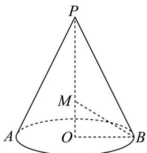

> [!faq]- 《专题8.1 基本立体图形（高效培优讲义）》官方解析
>
> > [!success]- **【答案】** B
>
> > [!note]- **【分析】**
> > 求出圆锥的底面圆半径和高，找到球心的位置，根据半径相等得到方程，求出 $R = \frac{5\sqrt{2}}{4}$ ，进而求出
> >
> > 外接球表面积·
>
> > [!note]- **【解析】**
> > 圆锥母线长 $l = \sqrt{5}$ ，设圆锥底面圆半径为 $r$ ，则 $\pi rl = \sqrt{15}\pi$
> >
> > 解得 $r = \frac{\sqrt{15}}{l} = \sqrt{3}$ ，圆锥的高为 $\sqrt{l^2 - r^2} = \sqrt{2}$
> >
> > 设圆锥 PO 的外接球的球心为 M ，则 M 在 OP 上，设半径为 R ，
> >
> > 则 $MB = MP = R$ ， $OM = \sqrt{2} -R$
> >
> > $$
> > O M ^ {2} + O B ^ {2} = M B ^ {2} = M P ^ {2}
> > $$
> >
> > 即 $\left(\sqrt{2} - R\right)^2 + \sqrt{3}^2 = R^2$ ，解得 $R = \frac{5\sqrt{2}}{4}$
> >
> > 故圆锥 $PO$ 的外接球的表面积为 $4\pi R^{2} = \frac{25\pi}{2}$
> >
> > 
> >
> > 故选 **B**
