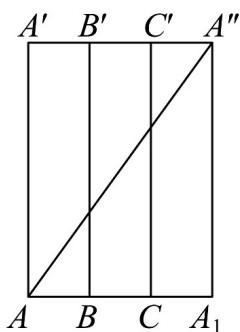
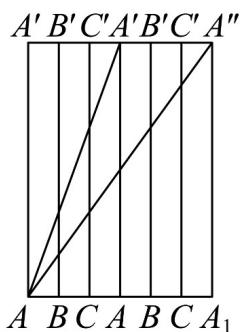

> [!faq]- 《专题8.1 基本立体图形（高效培优讲义）》官方解析
>
> > [!success]- **【答案】** (1) $\sqrt{73}$ (2)10
>
> > [!note]- **【分析】**
> > （ $^{1}$ ）由三棱柱的侧面展开图即可求解；
> >
> > (2) 将三棱柱的侧面都沿 $AA'$ 剪开，再拼接一次即可求解
>
> > [!note]- **【解析】**
> > （1）将三棱柱侧面沿侧棱 $AA'$ 剪开，展成平面图形如图所示，则 $AA''$ 即为所求的最短路线。
> >
> > 
> >
> > 在 $\mathrm{Rt}\triangle AA_1A''$ 中， $AA_{1} = 3$ ， $A_{1}A^{\prime} = 8$
> >
> > $AA'' = \sqrt{3^2 + 8^2} = \sqrt{73}$
> >
> > (2)
> >
> > 
> >
> > 将三棱柱的侧面都沿 $AA'$ 剪开，然后展开并拼接成如图所示，则 $AA''$ 即为所求的最短路线．
> > 在 $Rt\triangle AA_{1}A''$ 中， $AA_{1}=6,\quad A_{1}A''=8,\quad AA''=\sqrt{6^{2}+8^{2}}=\sqrt{100}=10$
